# PropTech Platform - Additional Diagrams

## System Architecture Diagrams

### 1. Complete System Architecture

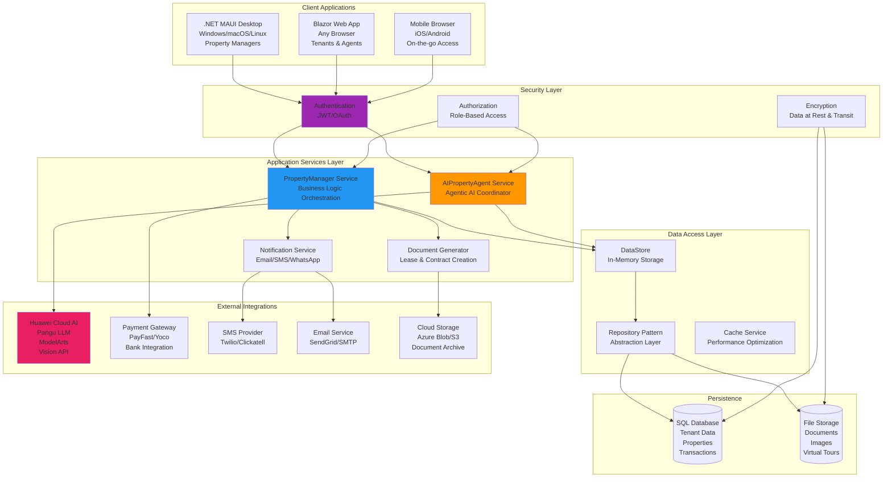
```mermaid
graph TB
    subgraph "Client Applications"
        MAUI[.NET MAUI Desktop<br/>Windows/macOS/Linux<br/>Property Managers]
        BLAZOR[Blazor Web App<br/>Any Browser<br/>Tenants & Agents]
        MOBILE[Mobile Browser<br/>iOS/Android<br/>On-the-go Access]
    end
    
    subgraph "Application Services Layer"
        PM[PropertyManager Service<br/>Business Logic Orchestration]
        AI_AGENT[AIPropertyAgent Service<br/>Agentic AI Coordinator]
        DOC_GEN[Document Generator<br/>Lease & Contract Creation]
        NOTIFY[Notification Service<br/>Email/SMS/WhatsApp]
    end
    
    subgraph "Data Access Layer"
        DS[DataStore<br/>In-Memory Storage]
        REPO[Repository Pattern<br/>Abstraction Layer]
        CACHE[Cache Service<br/>Performance Optimization]
    end
    
    subgraph "External Integrations"
        HUAWEI[Huawei Cloud AI<br/>Pangu LLM<br/>ModelArts<br/>Vision API]
        PAYMENT[Payment Gateway<br/>PayFast/Yoco<br/>Bank Integration]
        SMS_SERVICE[SMS Provider<br/>Twilio/Clickatell]
        EMAIL[Email Service<br/>SendGrid/SMTP]
        STORAGE[Cloud Storage<br/>Azure Blob/S3<br/>Document Archive]
    end
    
    subgraph "Security Layer"
        AUTH[Authentication<br/>JWT/OAuth]
        AUTHZ[Authorization<br/>Role-Based Access]
        ENCRYPT[Encryption<br/>Data at Rest & Transit]
    end
    
    subgraph "Persistence"
        DB[(SQL Database<br/>Tenant Data<br/>Properties<br/>Transactions)]
        FILES[(File Storage<br/>Documents<br/>Images<br/>Virtual Tours)]
    end
    
    MAUI --> AUTH
    BLAZOR --> AUTH
    MOBILE --> AUTH
    
    AUTH --> PM
    AUTH --> AI_AGENT
    
    PM --> DS
    PM --> DOC_GEN
    PM --> NOTIFY
    
    AI_AGENT --> HUAWEI
    AI_AGENT --> DS
    
    DOC_GEN --> STORAGE
    NOTIFY --> SMS_SERVICE
    NOTIFY --> EMAIL
    
    DS --> REPO
    REPO --> DB
    REPO --> FILES
    
    PM --> PAYMENT
    
    AUTHZ --> PM
    AUTHZ --> AI_AGENT
    ENCRYPT --> DB
    ENCRYPT --> FILES
    
    style HUAWEI fill:#E91E63
    style AI_AGENT fill:#FF9800
    style PM fill:#2196F3
    style AUTH fill:#9C27B0
```

### 2. Data Flow Architecture

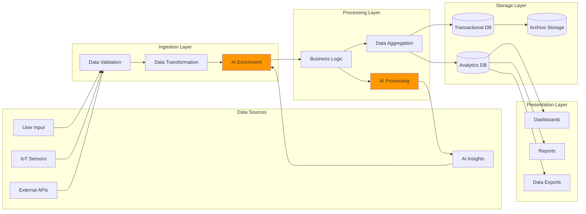
```mermaid
flowchart LR
    subgraph "Data Sources"
        USER[User Input]
        SENSOR[IoT Sensors]
        EXTERNAL[External APIs]
        AI_DATA[AI Insights]
    end
    
    subgraph "Ingestion Layer"
        VALIDATE[Data Validation]
        TRANSFORM[Data Transformation]
        ENRICH[AI Enrichment]
    end
    
    subgraph "Processing Layer"
        BUSINESS[Business Logic]
        AI_PROCESS[AI Processing]
        AGGREG[Data Aggregation]
    end
    
    subgraph "Storage Layer"
        TRANSACTIONAL[(Transactional DB)]
        ANALYTICAL[(Analytics DB)]
        ARCHIVE[(Archive Storage)]
    end
    
    subgraph "Presentation Layer"
        DASHBOARD[Dashboards]
        REPORTS[Reports]
        EXPORTS[Data Exports]
    end
    
    USER --> VALIDATE
    SENSOR --> VALIDATE
    EXTERNAL --> VALIDATE
    
    VALIDATE --> TRANSFORM
    TRANSFORM --> ENRICH
    ENRICH --> BUSINESS
    
    BUSINESS --> AI_PROCESS
    AI_PROCESS --> AI_DATA
    AI_DATA --> ENRICH
    
    BUSINESS --> AGGREG
    AGGREG --> TRANSACTIONAL
    AGGREG --> ANALYTICAL
    
    TRANSACTIONAL --> ARCHIVE
    
    ANALYTICAL --> DASHBOARD
    ANALYTICAL --> REPORTS
    ANALYTICAL --> EXPORTS
    
    style AI_PROCESS fill:#FF9800
    style ENRICH fill:#FF9800
```

### 3. Microservices Architecture (Future State)

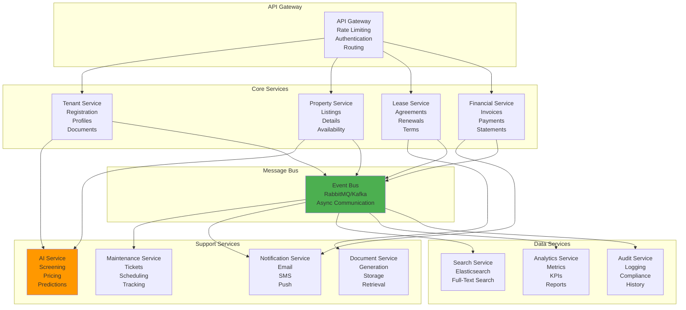
```mermaid
graph TB
    subgraph "API Gateway"
        GATEWAY[API Gateway<br/>Rate Limiting<br/>Authentication<br/>Routing]
    end
    
    subgraph "Core Services"
        TENANT_SVC[Tenant Service<br/>Registration<br/>Profiles<br/>Documents]
        PROPERTY_SVC[Property Service<br/>Listings<br/>Details<br/>Availability]
        LEASE_SVC[Lease Service<br/>Agreements<br/>Renewals<br/>Terms]
        FINANCE_SVC[Financial Service<br/>Invoices<br/>Payments<br/>Statements]
    end
    
    subgraph "Support Services"
        AI_SVC[AI Service<br/>Screening<br/>Pricing<br/>Predictions]
        MAINT_SVC[Maintenance Service<br/>Tickets<br/>Scheduling<br/>Tracking]
        NOTIF_SVC[Notification Service<br/>Email<br/>SMS<br/>Push]
        DOC_SVC[Document Service<br/>Generation<br/>Storage<br/>Retrieval]
    end
    
    subgraph "Data Services"
        SEARCH_SVC[Search Service<br/>Elasticsearch<br/>Full-Text Search]
        ANALYTICS_SVC[Analytics Service<br/>Metrics<br/>KPIs<br/>Reports]
        AUDIT_SVC[Audit Service<br/>Logging<br/>Compliance<br/>History]
    end
    
    subgraph "Message Bus"
        EVENT_BUS[Event Bus<br/>RabbitMQ/Kafka<br/>Async Communication]
    end
    
    GATEWAY --> TENANT_SVC
    GATEWAY --> PROPERTY_SVC
    GATEWAY --> LEASE_SVC
    GATEWAY --> FINANCE_SVC
    
    TENANT_SVC --> AI_SVC
    TENANT_SVC --> EVENT_BUS
    
    PROPERTY_SVC --> AI_SVC
    PROPERTY_SVC --> EVENT_BUS
    
    LEASE_SVC --> DOC_SVC
    LEASE_SVC --> EVENT_BUS
    
    FINANCE_SVC --> NOTIF_SVC
    FINANCE_SVC --> EVENT_BUS
    
    EVENT_BUS --> MAINT_SVC
    EVENT_BUS --> NOTIF_SVC
    EVENT_BUS --> SEARCH_SVC
    EVENT_BUS --> ANALYTICS_SVC
    EVENT_BUS --> AUDIT_SVC
    
    style AI_SVC fill:#FF9800
    style EVENT_BUS fill:#4CAF50
```

---

## State Machine Diagrams

### 1. Tenant Application State Machine

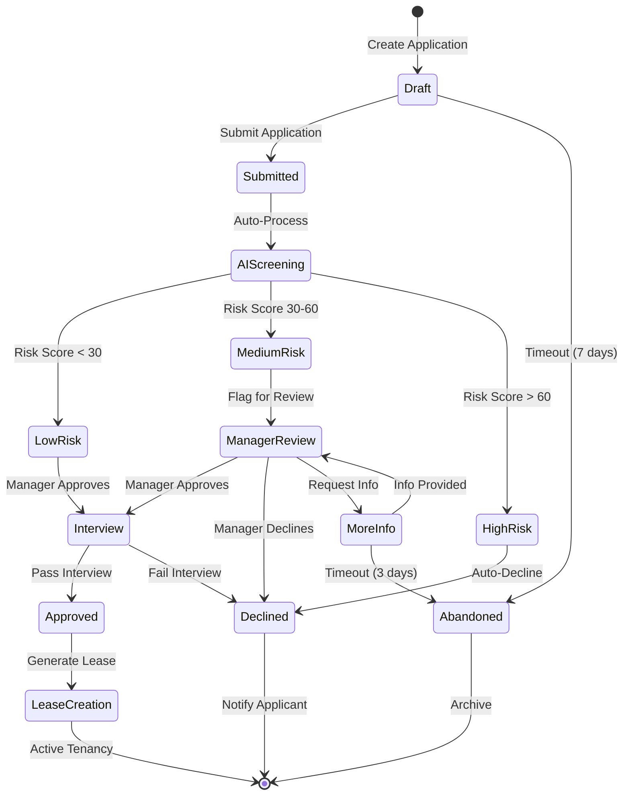
```mermaid
stateDiagram-v2
    [*] --> Draft: Create Application
    Draft --> Submitted: Submit Application
    Draft --> Abandoned: Timeout (7 days)
    
    Submitted --> AIScreening: Auto-Process
    
    AIScreening --> LowRisk: Risk Score < 30
    AIScreening --> MediumRisk: Risk Score 30-60
    AIScreening --> HighRisk: Risk Score > 60
    
    LowRisk --> Interview: Manager Approves
    MediumRisk --> ManagerReview: Flag for Review
    HighRisk --> Declined: Auto-Decline
    
    ManagerReview --> Interview: Manager Approves
    ManagerReview --> Declined: Manager Declines
    ManagerReview --> MoreInfo: Request Info
    
    MoreInfo --> ManagerReview: Info Provided
    MoreInfo --> Abandoned: Timeout (3 days)
    
    Interview --> Approved: Pass Interview
    Interview --> Declined: Fail Interview
    
    Approved --> LeaseCreation: Generate Lease
    Declined --> [*]: Notify Applicant
    Abandoned --> [*]: Archive
    
    LeaseCreation --> [*]: Active Tenancy
```

### 2. Maintenance Request State Machine

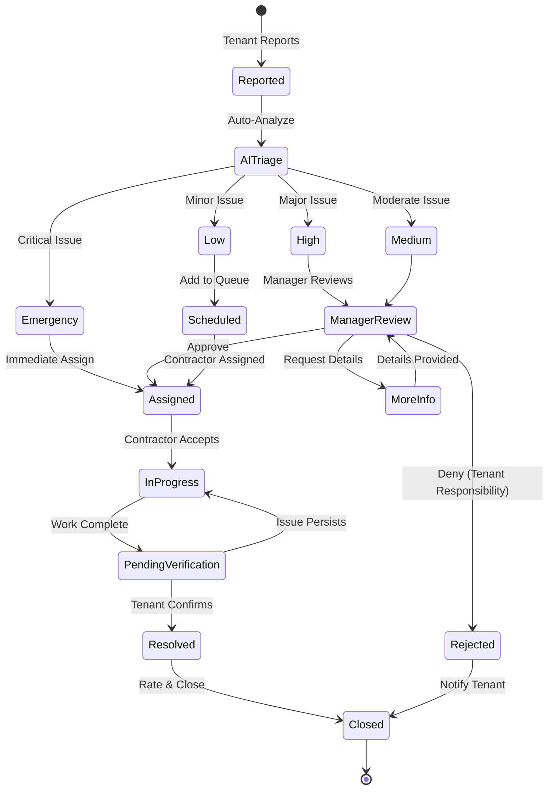
```mermaid
stateDiagram-v2
    [*] --> Reported: Tenant Reports
    Reported --> AITriage: Auto-Analyze
    
    AITriage --> Emergency: Critical Issue
    AITriage --> High: Major Issue
    AITriage --> Medium: Moderate Issue
    AITriage --> Low: Minor Issue
    
    Emergency --> Assigned: Immediate Assign
    High --> ManagerReview: Manager Reviews
    Medium --> ManagerReview
    Low --> Scheduled: Add to Queue
    
    ManagerReview --> Assigned: Approve
    ManagerReview --> Rejected: Deny (Tenant Responsibility)
    ManagerReview --> MoreInfo: Request Details
    
    MoreInfo --> ManagerReview: Details Provided
    
    Assigned --> InProgress: Contractor Accepts
    Scheduled --> Assigned: Contractor Assigned
    
    InProgress --> PendingVerification: Work Complete
    
    PendingVerification --> Resolved: Tenant Confirms
    PendingVerification --> InProgress: Issue Persists
    
    Resolved --> Closed: Rate & Close
    Rejected --> Closed: Notify Tenant
    
    Closed --> [*]
```

### 3. Payment Processing State Machine

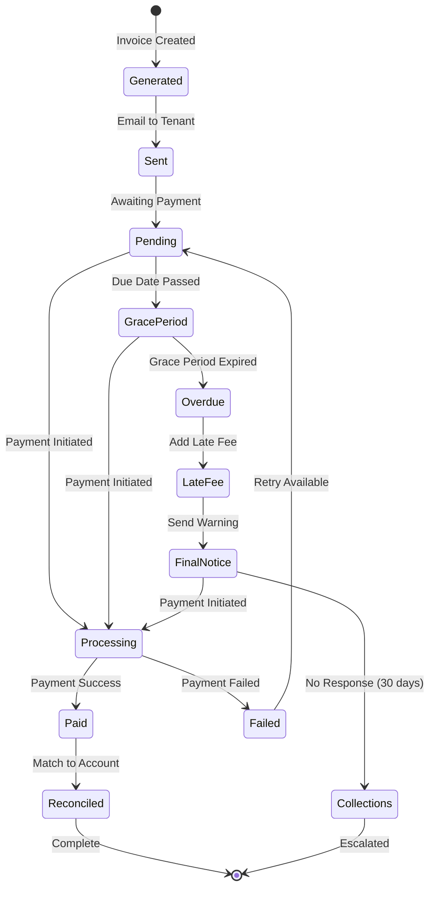
```mermaid
stateDiagram-v2
    [*] --> Generated: Invoice Created
    Generated --> Sent: Email to Tenant
    
    Sent --> Pending: Awaiting Payment
    
    Pending --> Processing: Payment Initiated
    Pending --> GracePeriod: Due Date Passed
    
    GracePeriod --> Processing: Payment Initiated
    GracePeriod --> Overdue: Grace Period Expired
    
    Processing --> Paid: Payment Success
    Processing --> Failed: Payment Failed
    
    Failed --> Pending: Retry Available
    
    Paid --> Reconciled: Match to Account
    
    Overdue --> LateFee: Add Late Fee
    LateFee --> FinalNotice: Send Warning
    
    FinalNotice --> Processing: Payment Initiated
    FinalNotice --> Collections: No Response (30 days)
    
    Reconciled --> [*]: Complete
    Collections --> [*]: Escalated
```

### 4. Lease Lifecycle State Machine

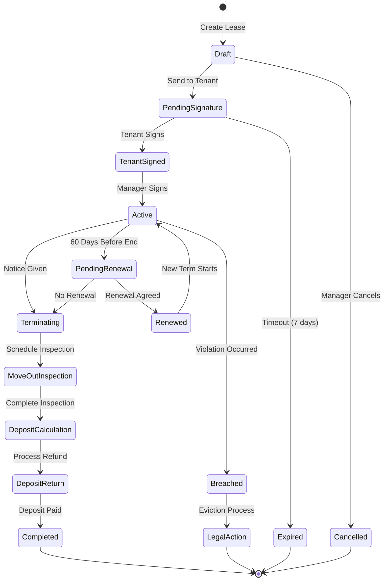
```mermaid
stateDiagram-v2
    [*] --> Draft: Create Lease
    Draft --> PendingSignature: Send to Tenant
    Draft --> Cancelled: Manager Cancels
    
    PendingSignature --> TenantSigned: Tenant Signs
    PendingSignature --> Expired: Timeout (7 days)
    
    TenantSigned --> Active: Manager Signs
    
    Active --> PendingRenewal: 60 Days Before End
    Active --> Terminating: Notice Given
    Active --> Breached: Violation Occurred
    
    PendingRenewal --> Renewed: Renewal Agreed
    PendingRenewal --> Terminating: No Renewal
    
    Renewed --> Active: New Term Starts
    
    Terminating --> MoveOutInspection: Schedule Inspection
    
    MoveOutInspection --> DepositCalculation: Complete Inspection
    
    DepositCalculation --> DepositReturn: Process Refund
    
    DepositReturn --> Completed: Deposit Paid
    
    Breached --> LegalAction: Eviction Process
    
    Completed --> [*]
    LegalAction --> [*]
    Expired --> [*]
    Cancelled --> [*]
```

---

## Deployment Diagrams

### 1. Production Deployment

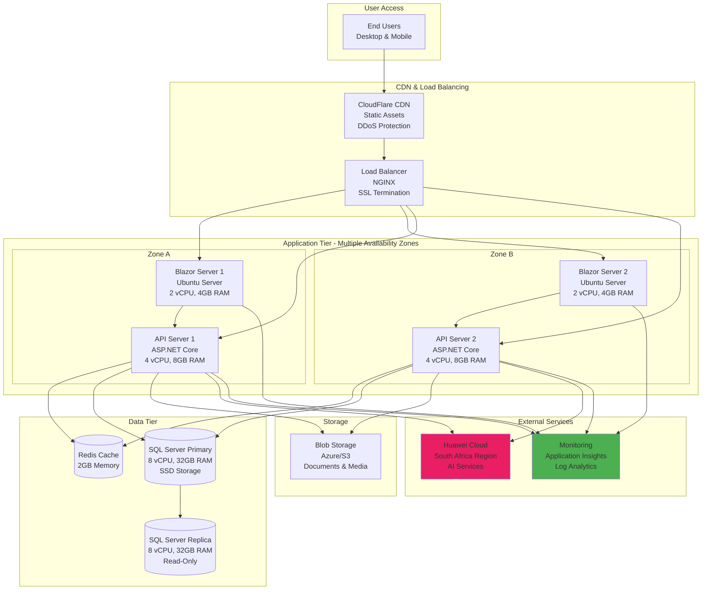
```mermaid
graph TB
    subgraph "User Access"
        USERS[End Users<br/>Desktop & Mobile]
    end
    
    subgraph "CDN & Load Balancing"
        CDN[CloudFlare CDN<br/>Static Assets<br/>DDoS Protection]
        LB[Load Balancer<br/>NGINX<br/>SSL Termination]
    end
    
    subgraph "Application Tier - Multiple Availability Zones"
        subgraph "Zone A"
            WEB1[Blazor Server 1<br/>Ubuntu Server<br/>2 vCPU, 4GB RAM]
            API1[API Server 1<br/>ASP.NET Core<br/>4 vCPU, 8GB RAM]
        end
        
        subgraph "Zone B"
            WEB2[Blazor Server 2<br/>Ubuntu Server<br/>2 vCPU, 4GB RAM]
            API2[API Server 2<br/>ASP.NET Core<br/>4 vCPU, 8GB RAM]
        end
    end
    
    subgraph "Data Tier"
        DB_PRIMARY[(SQL Server Primary<br/>8 vCPU, 32GB RAM<br/>SSD Storage)]
        DB_REPLICA[(SQL Server Replica<br/>8 vCPU, 32GB RAM<br/>Read-Only)]
        REDIS[(Redis Cache<br/>2GB Memory)]
    end
    
    subgraph "Storage"
        BLOB[Blob Storage<br/>Azure/S3<br/>Documents & Media]
    end
    
    subgraph "External Services"
        HUAWEI_CLOUD[Huawei Cloud<br/>South Africa Region<br/>AI Services]
        MONITORING[Monitoring<br/>Application Insights<br/>Log Analytics]
    end
    
    USERS --> CDN
    CDN --> LB
    
    LB --> WEB1
    LB --> WEB2
    LB --> API1
    LB --> API2
    
    WEB1 --> API1
    WEB2 --> API2
    
    API1 --> REDIS
    API2 --> REDIS
    
    API1 --> DB_PRIMARY
    API2 --> DB_PRIMARY
    
    DB_PRIMARY --> DB_REPLICA
    
    API1 --> BLOB
    API2 --> BLOB
    
    API1 --> HUAWEI_CLOUD
    API2 --> HUAWEI_CLOUD
    
    WEB1 --> MONITORING
    WEB2 --> MONITORING
    API1 --> MONITORING
    API2 --> MONITORING
    
    style HUAWEI_CLOUD fill:#E91E63
    style MONITORING fill:#4CAF50
```

### 2. Development Environment

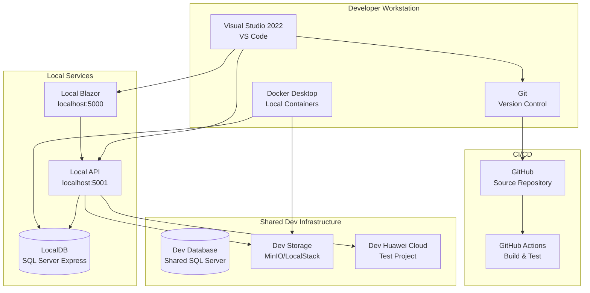
```mermaid
graph TB
    subgraph "Developer Workstation"
        IDE[Visual Studio 2022<br/>VS Code]
        DOCKER[Docker Desktop<br/>Local Containers]
        GIT[Git<br/>Version Control]
    end
    
    subgraph "Local Services"
        LOCAL_API[Local API<br/>localhost:5001]
        LOCAL_WEB[Local Blazor<br/>localhost:5000]
        LOCAL_DB[(LocalDB<br/>SQL Server Express)]
    end
    
    subgraph "Shared Dev Infrastructure"
        DEV_DB[(Dev Database<br/>Shared SQL Server)]
        DEV_STORAGE[Dev Storage<br/>MinIO/LocalStack]
        DEV_HUAWEI[Dev Huawei Cloud<br/>Test Project]
    end
    
    subgraph "CI/CD"
        GITHUB[GitHub<br/>Source Repository]
        ACTIONS[GitHub Actions<br/>Build & Test]
    end
    
    IDE --> LOCAL_API
    IDE --> LOCAL_WEB
    IDE --> GIT
    
    LOCAL_API --> LOCAL_DB
    LOCAL_WEB --> LOCAL_API
    
    LOCAL_API --> DEV_STORAGE
    LOCAL_API --> DEV_HUAWEI
    
    GIT --> GITHUB
    GITHUB --> ACTIONS
    
    DOCKER --> LOCAL_DB
    DOCKER --> DEV_STORAGE
```

---

## Integration Diagrams

### 1. Huawei Cloud AI Integration

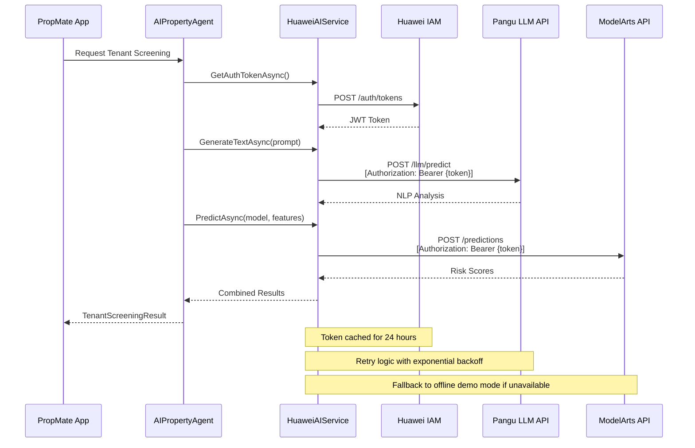
```mermaid
sequenceDiagram
    participant App as PropMate App
    participant AI_Agent as AIPropertyAgent
    participant HAI_Svc as HuaweiAIService
    participant IAM as Huawei IAM
    participant Pangu as Pangu LLM API
    participant ModelArts as ModelArts API
    
    App->>AI_Agent: Request Tenant Screening
    AI_Agent->>HAI_Svc: GetAuthTokenAsync()
    HAI_Svc->>IAM: POST /auth/tokens
    IAM-->>HAI_Svc: JWT Token
    
    AI_Agent->>HAI_Svc: GenerateTextAsync(prompt)
    HAI_Svc->>Pangu: POST /llm/predict<br/>[Authorization: Bearer {token}]
    Pangu-->>HAI_Svc: NLP Analysis
    
    AI_Agent->>HAI_Svc: PredictAsync(model, features)
    HAI_Svc->>ModelArts: POST /predictions<br/>[Authorization: Bearer {token}]
    ModelArts-->>HAI_Svc: Risk Scores
    
    HAI_Svc-->>AI_Agent: Combined Results
    AI_Agent-->>App: TenantScreeningResult
    
    Note over HAI_Svc,IAM: Token cached for 24 hours
    Note over HAI_Svc,Pangu: Retry logic with exponential backoff
    Note over HAI_Svc,ModelArts: Fallback to offline demo mode if unavailable
```

### 2. Payment Gateway Integration

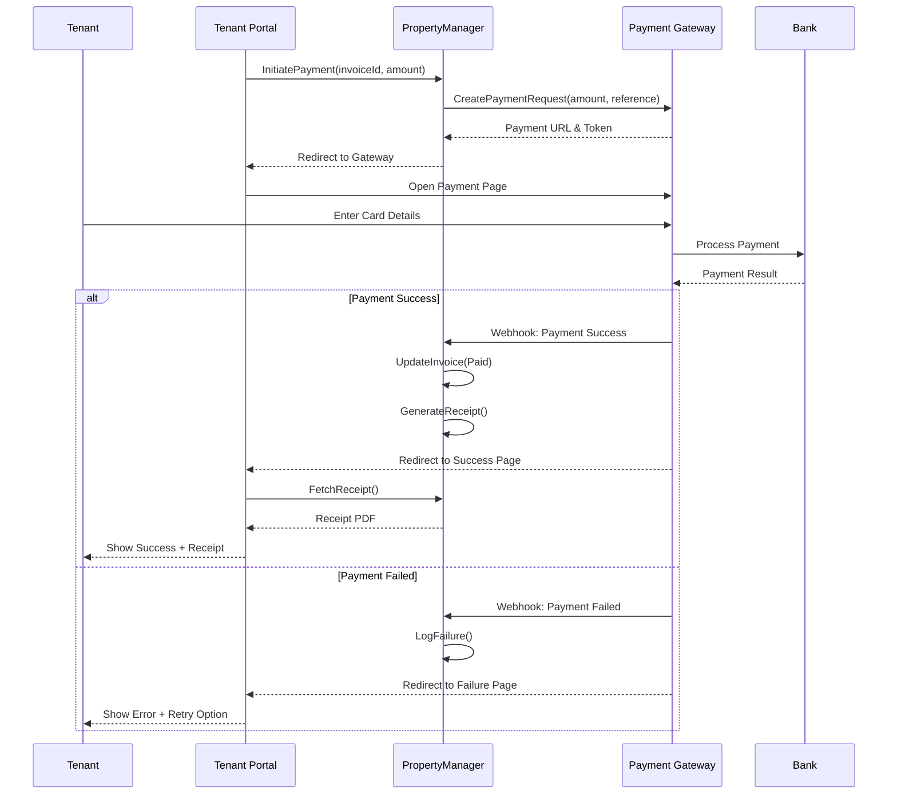
```mermaid
sequenceDiagram
    participant Tenant
    participant Portal as Tenant Portal
    participant PM as PropertyManager
    participant Gateway as Payment Gateway
    participant Bank
    
    Portal->>PM: InitiatePayment(invoiceId, amount)
    PM->>Gateway: CreatePaymentRequest(amount, reference)
    Gateway-->>PM: Payment URL & Token
    PM-->>Portal: Redirect to Gateway
    
    Portal->>Gateway: Open Payment Page
    Tenant->>Gateway: Enter Card Details
    Gateway->>Bank: Process Payment
    Bank-->>Gateway: Payment Result
    
    alt Payment Success
        Gateway->>PM: Webhook: Payment Success
        PM->>PM: UpdateInvoice(Paid)
        PM->>PM: GenerateReceipt()
        Gateway-->>Portal: Redirect to Success Page
        Portal->>PM: FetchReceipt()
        PM-->>Portal: Receipt PDF
        Portal-->>Tenant: Show Success + Receipt
    else Payment Failed
        Gateway->>PM: Webhook: Payment Failed
        PM->>PM: LogFailure()
        Gateway-->>Portal: Redirect to Failure Page
        Portal-->>Tenant: Show Error + Retry Option
    end
```

---

## Security Architecture

### 1. Authentication & Authorization Flow

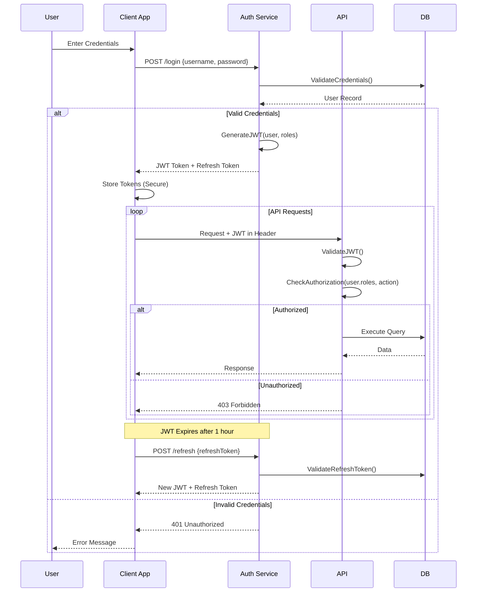
```mermaid
sequenceDiagram
    participant User
    participant Client as Client App
    participant Auth as Auth Service
    participant API
    participant DB
    
    User->>Client: Enter Credentials
    Client->>Auth: POST /login {username, password}
    Auth->>DB: ValidateCredentials()
    DB-->>Auth: User Record
    
    alt Valid Credentials
        Auth->>Auth: GenerateJWT(user, roles)
        Auth-->>Client: JWT Token + Refresh Token
        Client->>Client: Store Tokens (Secure)
        
        loop API Requests
            Client->>API: Request + JWT in Header
            API->>API: ValidateJWT()
            API->>API: CheckAuthorization(user.roles, action)
            
            alt Authorized
                API->>DB: Execute Query
                DB-->>API: Data
                API-->>Client: Response
            else Unauthorized
                API-->>Client: 403 Forbidden
            end
        end
        
        Note over Client,Auth: JWT Expires after 1 hour
        
        Client->>Auth: POST /refresh {refreshToken}
        Auth->>DB: ValidateRefreshToken()
        Auth-->>Client: New JWT + Refresh Token
        
    else Invalid Credentials
        Auth-->>Client: 401 Unauthorized
        Client-->>User: Error Message
    end
```

### 2. Data Encryption Flow

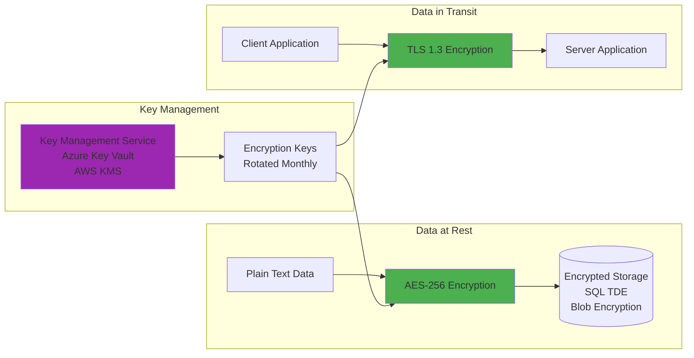
```mermaid
graph LR
    subgraph "Data at Rest"
        PLAIN1[Plain Text Data]
        ENCRYPT1[AES-256 Encryption]
        STORED[(Encrypted Storage<br/>SQL TDE<br/>Blob Encryption)]
    end
    
    subgraph "Data in Transit"
        CLIENT[Client Application]
        TLS[TLS 1.3 Encryption]
        SERVER[Server Application]
    end
    
    subgraph "Key Management"
        KMS[Key Management Service<br/>Azure Key Vault<br/>AWS KMS]
        KEYS[Encryption Keys<br/>Rotated Monthly]
    end
    
    PLAIN1 --> ENCRYPT1
    ENCRYPT1 --> STORED
    
    CLIENT --> TLS
    TLS --> SERVER
    
    KMS --> KEYS
    KEYS --> ENCRYPT1
    KEYS --> TLS
    
    style ENCRYPT1 fill:#4CAF50
    style TLS fill:#4CAF50
    style KMS fill:#9C27B0
```

---

## Performance Optimization

### 1. Caching Strategy

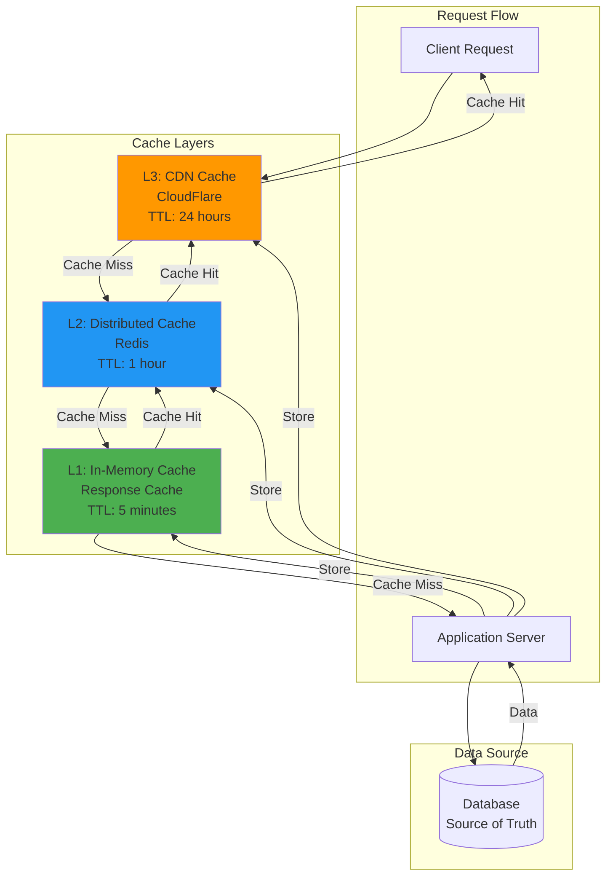
```mermaid
graph TB
    subgraph "Request Flow"
        REQUEST[Client Request]
        APP[Application Server]
    end
    
    subgraph "Cache Layers"
        L1[L1: In-Memory Cache<br/>Response Cache<br/>TTL: 5 minutes]
        L2[L2: Distributed Cache<br/>Redis<br/>TTL: 1 hour]
        L3[L3: CDN Cache<br/>CloudFlare<br/>TTL: 24 hours]
    end
    
    subgraph "Data Source"
        DB[(Database<br/>Source of Truth)]
    end
    
    REQUEST --> L3
    L3 -->|Cache Miss| L2
    L2 -->|Cache Miss| L1
    L1 -->|Cache Miss| APP
    APP --> DB
    
    DB -->|Data| APP
    APP -->|Store| L1
    APP -->|Store| L2
    APP -->|Store| L3
    
    L3 -->|Cache Hit| REQUEST
    L2 -->|Cache Hit| L3
    L1 -->|Cache Hit| L2
    
    style L1 fill:#4CAF50
    style L2 fill:#2196F3
    style L3 fill:#FF9800
```

### 2. Database Optimization

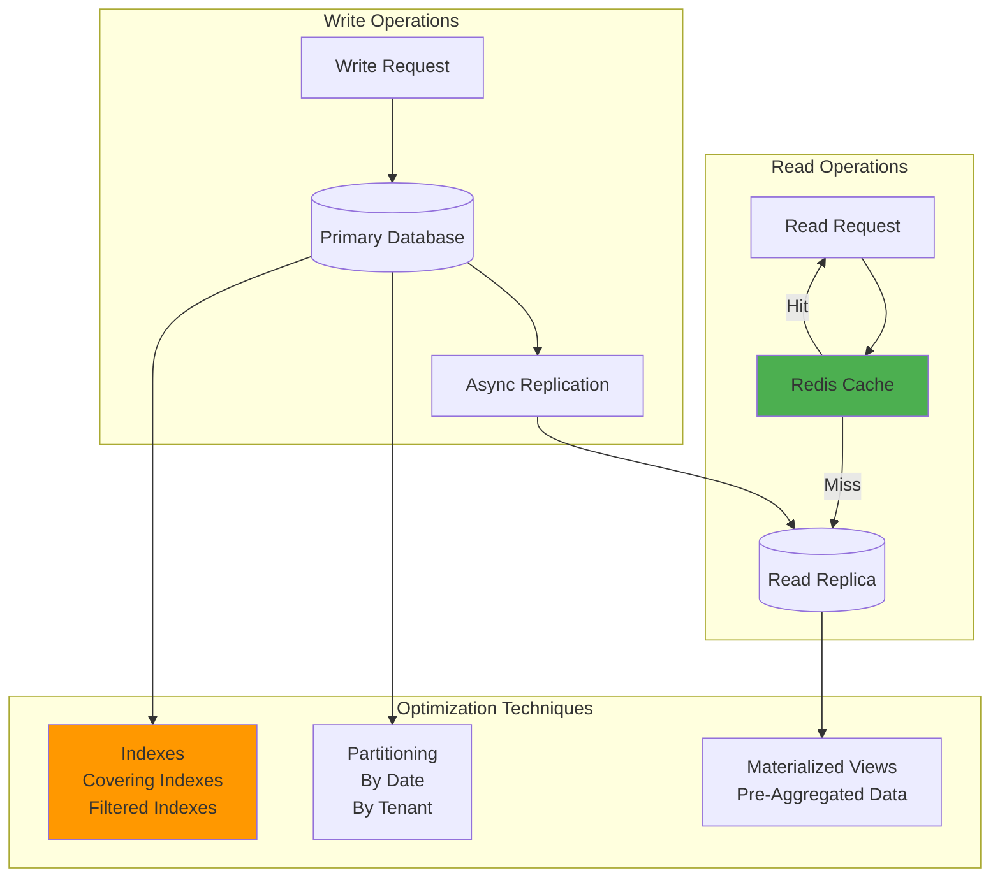
```mermaid
graph TB
    subgraph "Read Operations"
        READ_REQ[Read Request]
        READ_CACHE[Redis Cache]
        READ_REPLICA[(Read Replica)]
    end
    
    subgraph "Write Operations"
        WRITE_REQ[Write Request]
        PRIMARY[(Primary Database)]
        REPLICATION[Async Replication]
    end
    
    subgraph "Optimization Techniques"
        INDEX[Indexes<br/>Covering Indexes<br/>Filtered Indexes]
        PARTITION[Partitioning<br/>By Date<br/>By Tenant]
        MATERIALIZE[Materialized Views<br/>Pre-Aggregated Data]
    end
    
    READ_REQ --> READ_CACHE
    READ_CACHE -->|Miss| READ_REPLICA
    READ_CACHE -->|Hit| READ_REQ
    
    WRITE_REQ --> PRIMARY
    PRIMARY --> REPLICATION
    REPLICATION --> READ_REPLICA
    
    PRIMARY --> INDEX
    PRIMARY --> PARTITION
    READ_REPLICA --> MATERIALIZE
    
    style READ_CACHE fill:#4CAF50
    style INDEX fill:#FF9800
```

---

## Monitoring & Observability

### 1. Monitoring Architecture

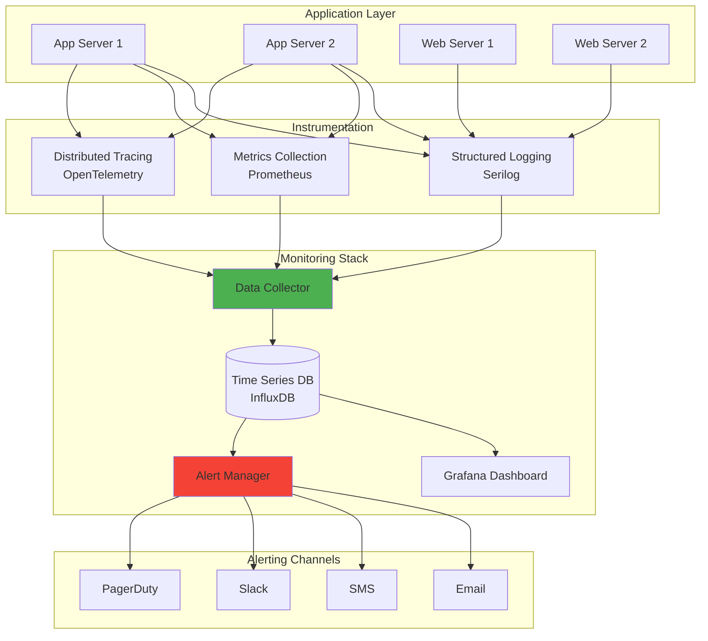
```mermaid
graph TB
    subgraph "Application Layer"
        APP1[App Server 1]
        APP2[App Server 2]
        WEB1[Web Server 1]
        WEB2[Web Server 2]
    end
    
    subgraph "Instrumentation"
        LOGS[Structured Logging<br/>Serilog]
        METRICS[Metrics Collection<br/>Prometheus]
        TRACES[Distributed Tracing<br/>OpenTelemetry]
    end
    
    subgraph "Monitoring Stack"
        COLLECTOR[Data Collector]
        STORAGE[(Time Series DB<br/>InfluxDB)]
        DASHBOARD[Grafana Dashboard]
        ALERTS[Alert Manager]
    end
    
    subgraph "Alerting Channels"
        EMAIL_ALERT[Email]
        SMS_ALERT[SMS]
        SLACK[Slack]
        PAGER[PagerDuty]
    end
    
    APP1 --> LOGS
    APP2 --> LOGS
    WEB1 --> LOGS
    WEB2 --> LOGS
    
    APP1 --> METRICS
    APP2 --> METRICS
    
    APP1 --> TRACES
    APP2 --> TRACES
    
    LOGS --> COLLECTOR
    METRICS --> COLLECTOR
    TRACES --> COLLECTOR
    
    COLLECTOR --> STORAGE
    STORAGE --> DASHBOARD
    STORAGE --> ALERTS
    
    ALERTS --> EMAIL_ALERT
    ALERTS --> SMS_ALERT
    ALERTS --> SLACK
    ALERTS --> PAGER
    
    style COLLECTOR fill:#4CAF50
    style ALERTS fill:#F44336
```

### 2. Health Check System

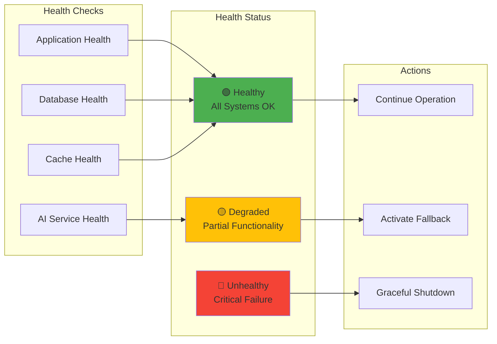
```mermaid
graph LR
    subgraph "Health Checks"
        APP_HEALTH[Application Health]
        DB_HEALTH[Database Health]
        AI_HEALTH[AI Service Health]
        CACHE_HEALTH[Cache Health]
    end
    
    subgraph "Health Status"
        HEALTHY[🟢 Healthy<br/>All Systems OK]
        DEGRADED[🟡 Degraded<br/>Partial Functionality]
        UNHEALTHY[🔴 Unhealthy<br/>Critical Failure]
    end
    
    subgraph "Actions"
        CONTINUE[Continue Operation]
        FALLBACK[Activate Fallback]
        SHUTDOWN[Graceful Shutdown]
    end
    
    APP_HEALTH --> HEALTHY
    DB_HEALTH --> HEALTHY
    AI_HEALTH --> DEGRADED
    CACHE_HEALTH --> HEALTHY
    
    HEALTHY --> CONTINUE
    DEGRADED --> FALLBACK
    UNHEALTHY --> SHUTDOWN
    
    style HEALTHY fill:#4CAF50
    style DEGRADED fill:#FFC107
    style UNHEALTHY fill:#F44336
```

---

## Disaster Recovery

### 1. Backup Strategy

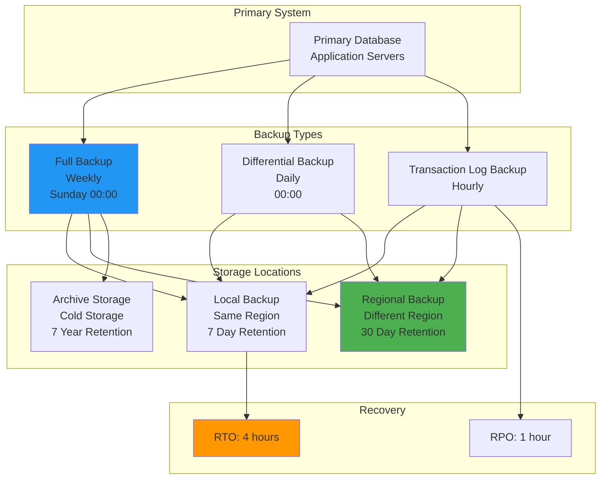
```mermaid
graph TB
    subgraph "Primary System"
        PRIMARY[Primary Database<br/>Application Servers]
    end
    
    subgraph "Backup Types"
        FULL[Full Backup<br/>Weekly<br/>Sunday 00:00]
        DIFF[Differential Backup<br/>Daily<br/>00:00]
        LOG[Transaction Log Backup<br/>Hourly]
    end
    
    subgraph "Storage Locations"
        LOCAL[Local Backup<br/>Same Region<br/>7 Day Retention]
        REGIONAL[Regional Backup<br/>Different Region<br/>30 Day Retention]
        ARCHIVE[Archive Storage<br/>Cold Storage<br/>7 Year Retention]
    end
    
    subgraph "Recovery"
        RTO[RTO: 4 hours]
        RPO[RPO: 1 hour]
    end
    
    PRIMARY --> FULL
    PRIMARY --> DIFF
    PRIMARY --> LOG
    
    FULL --> LOCAL
    FULL --> REGIONAL
    FULL --> ARCHIVE
    
    DIFF --> LOCAL
    DIFF --> REGIONAL
    
    LOG --> LOCAL
    LOG --> REGIONAL
    
    LOCAL --> RTO
    LOG --> RPO
    
    style FULL fill:#2196F3
    style REGIONAL fill:#4CAF50
    style RTO fill:#FF9800
```

---

## Conclusion

These additional diagrams provide comprehensive visualization of:
- System architecture at multiple levels
- State machines for key processes
- Deployment strategies
- Integration patterns
- Security architecture
- Performance optimization
- Monitoring and observability
- Disaster recovery planning

Use these diagrams in conjunction with the user flows and wireframes to gain complete understanding of the PropTech platform architecture and operations.
