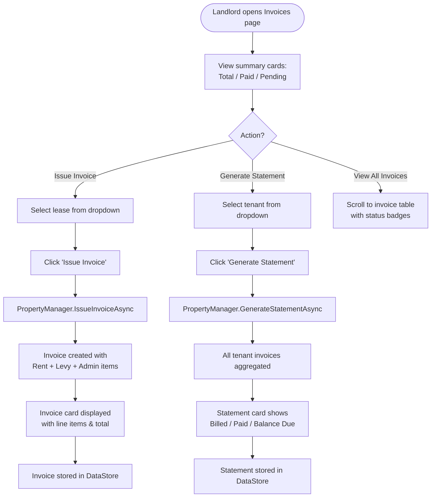

# PropMate — Figma Prototype & Board Designs

> This document describes the Figma board structure, prototype flows, and screen designs for the PropMate AI-powered property management platform. All screens are spec'd using the design tokens defined in `UX_WIREFRAMES.md`.

---

## Figma File Structure

```
PropMate Design System
├── 📁 00 - Design Tokens
│   ├── Colors
│   ├── Typography
│   ├── Spacing
│   ├── Shadows
│   └── Icons
├── 📁 01 - Components
│   ├── Buttons (Primary, Secondary, Danger, Ghost)
│   ├── Cards (Stat, Content, AI Insight)
│   ├── Badges (Status, Risk, AI Confidence)
│   ├── Inputs (Text, Select, Picker)
│   ├── Tables (Sortable, Striped)
│   ├── Navigation (Sidebar, NavBar, Flyout)
│   └── Invoice / Statement Card
├── 📁 02 - MAUI Desktop Screens
│   ├── Dashboard
│   ├── Properties
│   ├── Tenants
│   ├── Leases
│   ├── Maintenance
│   ├── 360° Virtual Tours
│   └── 🆕 Invoices & Billing
├── 📁 03 - Blazor Web Screens
│   ├── Dashboard
│   ├── Properties
│   ├── Tenants
│   ├── Leases
│   ├── Maintenance
│   ├── 360° Virtual Tours
│   └── 🆕 Invoices & Billing
├── 📁 04 - Mobile Responsive
│   ├── Dashboard (mobile)
│   ├── Tenants (mobile)
│   └── Invoices (mobile)
└── 📁 05 - Prototype Flows
    ├── Flow 1: Tenant Registration & AI Screening
    ├── Flow 2: Lease Creation & AI Clause
    ├── Flow 3: 360° Virtual Tour Inspection
    ├── Flow 4: AI Portfolio Analysis
    └── 🆕 Flow 5: Invoice Issuance & Statement Generation
```

---

## Design Tokens

### Colour Palette

| Name | Hex | Usage |
|------|-----|-------|
| `brand-primary` | `#1565C0` | Primary buttons, headers, links |
| `brand-secondary` | `#FF9800` | AI features, highlights |
| `brand-accent` | `#4CAF50` | Success states, paid invoices |
| `invoice-pending` | `#FFC107` | Pending payment badge |
| `invoice-overdue` | `#F44336` | Overdue payment badge |
| `invoice-paid` | `#4CAF50` | Paid invoice badge |
| `invoice-cancelled` | `#9E9E9E` | Cancelled invoice badge |
| `invoice-header-bg` | `#1565C0` | Invoice document header |
| `surface` | `#FFFFFF` | Cards, modals |
| `background` | `#F4F6F8` | Page background |
| `border` | `#E0E0E0` | Dividers, card borders |
| `text-primary` | `#212121` | Body text |
| `text-secondary` | `#757575` | Labels, secondary info |

### Typography Scale

| Token | Size | Weight | Usage |
|-------|------|--------|-------|
| `heading-xl` | 32px | 700 | Page titles |
| `heading-lg` | 24px | 700 | Section titles |
| `heading-md` | 20px | 600 | Card titles |
| `heading-sm` | 18px | 600 | Sub-sections |
| `body-lg` | 16px | 400 | Main content |
| `body-md` | 14px | 400 | Form labels, table cells |
| `body-sm` | 13px | 400 | Secondary info |
| `caption` | 12px | 400 | Timestamps, captions |
| `label` | 11px | 500 | Section labels (uppercase) |
| `invoice-total` | 18px | 700 | Invoice grand total |

---

## Screen Designs

### Screen 1 — Dashboard

```
╔══════════════════════════════════════════════════════════════════╗
║  🏠 PropMate AI                              [Profile] [Settings] ║
╠══════════════════════════════════════════════════════════════════╣
║                                                                  ║
║  Good morning, Jane! 👋                                          ║
║  Here's your portfolio overview for today.                       ║
║                                                                  ║
║  ┌──────────┐ ┌──────────┐ ┌──────────┐ ┌──────────┐           ║
║  │Properties│ │ Tenants  │ │  Leases  │ │AI Insights│           ║
║  │    4     │ │    6     │ │    4     │ │    12     │           ║
║  │ [Blue]   │ │ [Green]  │ │ [Cyan]   │ │ [Orange]  │           ║
║  └──────────┘ └──────────┘ └──────────┘ └──────────┘           ║
║                                                                  ║
║  ┌─────────────────────────────────────────────────────────┐    ║
║  │ 🤖 AI Portfolio Analysis                                │    ║
║  │ Last run: 25 Feb 2026, 10:30                            │    ║
║  │                         [Run AI Analysis]               │    ║
║  │                                                         │    ║
║  │  💰 Pricing: 12 Mandela Ave — R3,900/mo recommended     │    ║
║  │  🔧 Maintenance: 45 Long St — Plumbing alert (Medium)   │    ║
║  │  👤 Tenant: Thabo Mokoena — Low Risk ✓                  │    ║
║  │  📊 Occupancy: 75% — Stable demand forecast             │    ║
║  └─────────────────────────────────────────────────────────┘    ║
║                                                                  ║
╚══════════════════════════════════════════════════════════════════╝
```

### Screen 2 — Invoices & Billing (Full Design)

```
╔══════════════════════════════════════════════════════════════════╗
║  🏠 PropMate AI                              [Profile] [Settings] ║
╠════════════╦═════════════════════════════════════════════════════╣
║ Dashboard  ║  🧾 Invoices & Billing                              ║
║ Properties ║  Issue monthly rental invoices and generate         ║
║ Tenants    ║  tenant account statements.                         ║
║ Leases     ║                                                     ║
║ Maintnce   ║  ┌──────────┐ ┌──────────┐ ┌──────────────────┐   ║
║ 360° Tours ║  │  Total   │ │   Paid   │ │ Pending/Overdue  │   ║
║▶ Invoices  ║  │ Invoices │ │          │ │                  │   ║
║            ║  │    12    │ │    9     │ │        3         │   ║
║            ║  │ #1565C0  │ │ #4CAF50  │ │    #FFC107       │   ║
║            ║  └──────────┘ └──────────┘ └──────────────────┘   ║
║            ║                                                     ║
║            ║  ─── Issue Invoice ──────────────────────────────  ║
║            ║  Lease ▼                                           ║
║            ║  ┌──────────────────────────────────────────────┐  ║
║            ║  │ Thabo Mokoena — 12 Mandela Ave (R3,800)    ▼│  ║
║            ║  └──────────────────────────────────────────────┘  ║
║            ║                               ┌────────────────┐   ║
║            ║                               │ Issue Invoice  │   ║
║            ║                               │   #1565C0      │   ║
║            ║                               └────────────────┘   ║
║            ║                                                     ║
║            ║  ┌────────────────────────────────────────────┐    ║
║            ║  │ 🧾 Invoice — INV-2026-001        PENDING   │    ║
║            ║  │  Tenant:   Thabo Mokoena                   │    ║
║            ║  │  Property: 12 Mandela Ave, Soweto           │    ║
║            ║  │  Date: 01 Mar 2026  Due: 01 Apr 2026        │    ║
║            ║  │ ─────────────────────────────────────────   │    ║
║            ║  │  Monthly Rent              R 3,800          │    ║
║            ║  │  Water & Electricity Levy  R   350          │    ║
║            ║  │  Administration Fee        R   150          │    ║
║            ║  │                        ──────────────       │    ║
║            ║  │              TOTAL:    R 4,300              │    ║
║            ║  └────────────────────────────────────────────┘    ║
║            ║                                                     ║
║            ║  ─── Generate Statement ───────────────────────    ║
║            ║  Tenant ▼                                          ║
║            ║  ┌──────────────────────────────────────────────┐  ║
║            ║  │ Thabo Mokoena                               ▼│  ║
║            ║  └──────────────────────────────────────────────┘  ║
║            ║                           ┌──────────────────────┐  ║
║            ║                           │ Generate Statement   │  ║
║            ║                           │     #757575          │  ║
║            ║                           └──────────────────────┘  ║
║            ║                                                     ║
║            ║  ┌────────────────────────────────────────────┐    ║
║            ║  │ 📋 Account Statement — Thabo Mokoena       │    ║
║            ║  │  Period: 01 Mar – 31 Mar 2026               │    ║
║            ║  │  Opening Balance:  R     0                  │    ║
║            ║  │  Total Billed:     R 4,300                  │    ║
║            ║  │  Total Paid:       R     0                  │    ║
║            ║  │  Balance Due:    ► R 4,300 (red / bold)     │    ║
║            ║  │ ─────────────────────────────────────────   │    ║
║            ║  │  INV-001  01 Mar  01 Apr  R 4,300  PENDING  │    ║
║            ║  └────────────────────────────────────────────┘    ║
╚════════════╩═════════════════════════════════════════════════════╝
```

### Screen 3 — Invoice PDF Prototype

```
╔══════════════════════════════════════════════════════════════════╗
║                                                                  ║
║  ██████████  🏠 PropMate                    INVOICE             ║
║  ██████████  AI Property Management         INV-2026-001        ║
║              South Africa                   Status: PENDING     ║
║ ────────────────────────────────────────────────────────────    ║
║  BILLED TO                     LANDLORD                         ║
║  Thabo Mokoena                  Jane Smith                      ║
║  ID: 8912315423089              ID: 7501015009087               ║
║  thabo@email.com                12 Mandela Ave, Soweto          ║
║ ────────────────────────────────────────────────────────────    ║
║  Invoice Date: 01 Mar 2026      Lease Ref: LEASE-001            ║
║  Due Date:     01 Apr 2026      Period: March 2026              ║
║ ────────────────────────────────────────────────────────────    ║
║  DESCRIPTION              QTY   UNIT PRICE      AMOUNT         ║
║  Monthly Rent               1   R 3,800.00    R 3,800.00        ║
║  Water & Electricity Levy   1   R   350.00    R   350.00        ║
║  Administration Fee         1   R   150.00    R   150.00        ║
║                                             ─────────────       ║
║                                 TOTAL DUE:  R 4,300.00          ║
║ ────────────────────────────────────────────────────────────    ║
║  PAYMENT — EFT                                                  ║
║  Account Holder: Jane Smith        Bank: FNB                   ║
║  Account: 62012345678              Reference: INV-2026-001      ║
║ ────────────────────────────────────────────────────────────    ║
║  Generated by PropMate AI · Rental Housing Act (Act 50/1999)   ║
╚══════════════════════════════════════════════════════════════════╝
```

---

## Prototype Flows

### Flow 5 — Invoice Issuance & Statement Generation



### Flow 5 — Prototype Interaction States

| Step | UI Element | State | Behaviour |
|------|-----------|-------|-----------|
| 1 | Summary cards | Loaded | Show counts from DataStore |
| 2 | Lease dropdown | Populated | Lists all active leases |
| 3 | Issue Invoice btn | Idle → Loading → Done | Shows spinner during async call |
| 4 | Invoice card | Hidden → Visible | Animates in after issuance |
| 5 | Status badge | Pending | Yellow badge |
| 6 | Tenant dropdown | Populated | Lists registered tenants |
| 7 | Generate Statement btn | Idle → Loading → Done | Shows spinner |
| 8 | Statement card | Hidden → Visible | Shows balance in red if > 0 |
| 9 | All Invoices table | Updated | New invoice row appended |

---

## Component Specs

### Invoice Card Component

```
┌─────────────────────────────────────────────────────┐
│ Header: bg=#1565C0, text=white, padding=16px        │
│   🧾 Invoice — {id[..8]}...          [Status Badge] │
├─────────────────────────────────────────────────────┤
│ Body: bg=white, padding=16px                        │
│   Tenant: {name}                                    │
│   Property: {address}                               │
│   Date: {date}   Due: {dueDate}                     │
│   ───────────────────────────────────────────────── │
│   Line Items Table:                                 │
│   Description               Amount                  │
│   ─────────────────────────────                     │
│   {item.Description}        R {item.Total:N0}       │
│   ─────────────────────────────                     │
│   TOTAL                     R {total:N0} (bold)     │
└─────────────────────────────────────────────────────┘
```

### Statement Card Component

```
┌─────────────────────────────────────────────────────┐
│ Header: bg=#757575, text=white, padding=16px        │
│   📋 Account Statement — {tenantName}               │
├─────────────────────────────────────────────────────┤
│ Body: bg=white, padding=16px                        │
│   Period: {start} – {end}                           │
│   Opening Balance: R {openingBalance:N0}            │
│   Total Billed:    R {totalBilled:N0}               │
│   Total Paid:      R {totalPaid:N0}                 │
│   Balance Due:     R {balance:N0} ← red if > 0     │
│   ───────────────────────────────────────────────── │
│   Invoice Table (if invoices exist):                │
│   ID │ Date │ Due │ Amount │ Status Badge            │
└─────────────────────────────────────────────────────┘
```

### Status Badge Component

| Status | Background | Text | Icon |
|--------|-----------|------|------|
| Pending | `#FFC107` | `#212121` | ⏳ |
| Paid | `#4CAF50` | `#FFFFFF` | ✅ |
| Overdue | `#F44336` | `#FFFFFF` | ⚠️ |
| PartiallyPaid | `#03A9F4` | `#212121` | 📋 |
| Cancelled | `#9E9E9E` | `#FFFFFF` | ✕ |

---

## Responsive Behaviour

### Mobile — Invoices Screen (< 768px)

```
┌─────────────────────────┐
│ 🏠 PropMate  ≡           │
├─────────────────────────┤
│ 🧾 Invoices & Billing   │
│                         │
│ ┌──────────────────┐    │
│ │ Total: 12        │    │
│ └──────────────────┘    │
│ ┌──────────────────┐    │
│ │ Paid:  9         │    │
│ └──────────────────┘    │
│ ┌──────────────────┐    │
│ │ Pending: 3       │    │
│ └──────────────────┘    │
│                         │
│ Issue Invoice           │
│ [Select Lease ▼]        │
│ [Issue Invoice]         │
│                         │
│ Generate Statement      │
│ [Select Tenant ▼]       │
│ [Generate Statement]    │
│                         │
│ All Invoices ↓          │
│ ┌─────────────────────┐ │
│ │ Thabo — R4,300      │ │
│ │ 12 Mandela Ave      │ │
│ │ Due 01 Apr  PENDING │ │
│ └─────────────────────┘ │
└─────────────────────────┘
```

---

## Accessibility Notes

- All status badges have sufficient colour contrast (WCAG AA)
- Form labels are explicitly associated with inputs via `for`/`id`
- Invoice tables include proper `<thead>` and `<th scope="col">`
- Loading spinner includes `role="status"` and `aria-label="Loading"`
- Balance Due shown in red uses both colour AND bold text (not colour alone)
- Print stylesheet ensures invoice renders correctly without screen nav

---

## Export & Print

The invoice prototype supports:
- **Screen view**: Full interactive Blazor web page
- **Print view**: CSS `@media print` strips navigation and renders `InvoiceTemplate.html`
- **PDF**: Template `InvoiceTemplate.html` can be rendered to PDF via server-side or browser print-to-PDF
