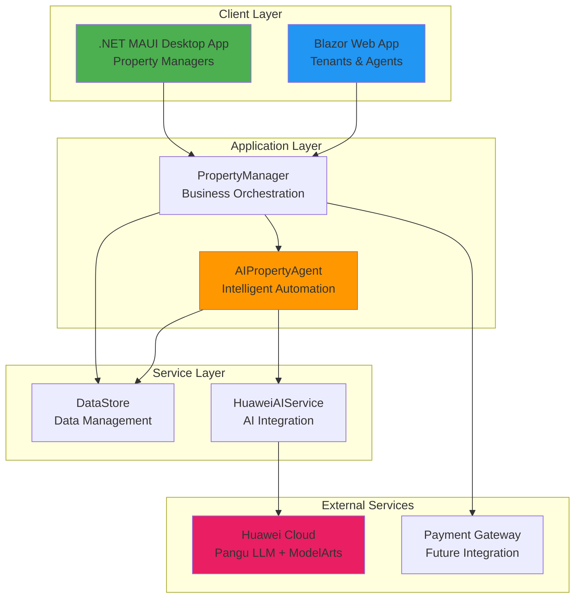
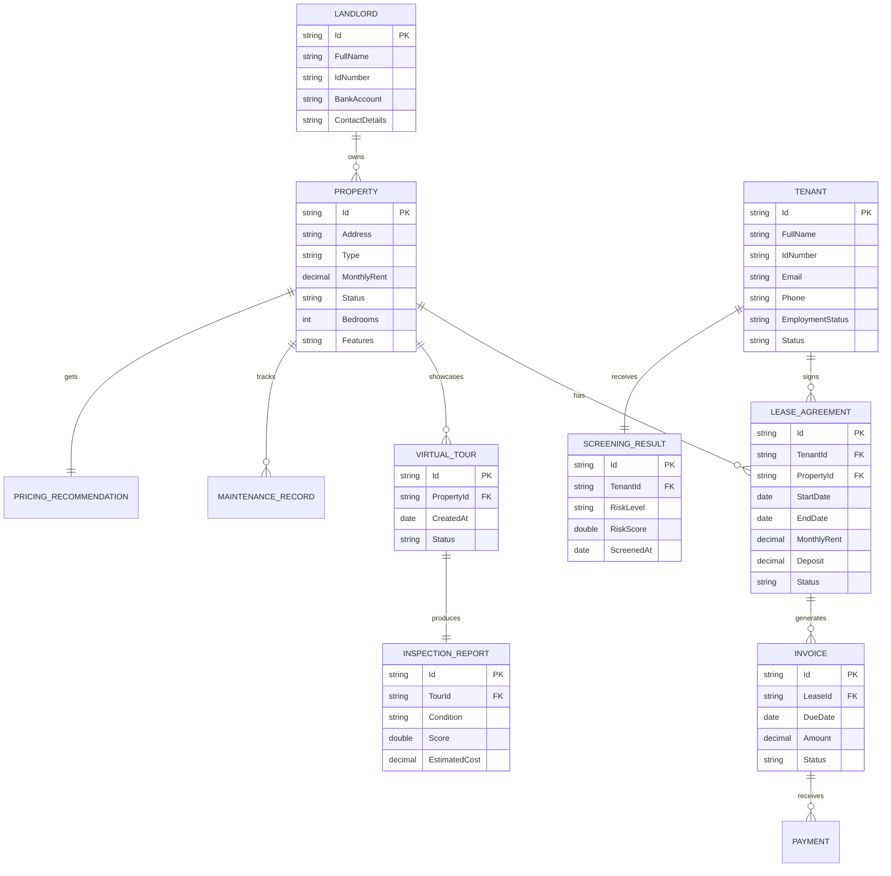
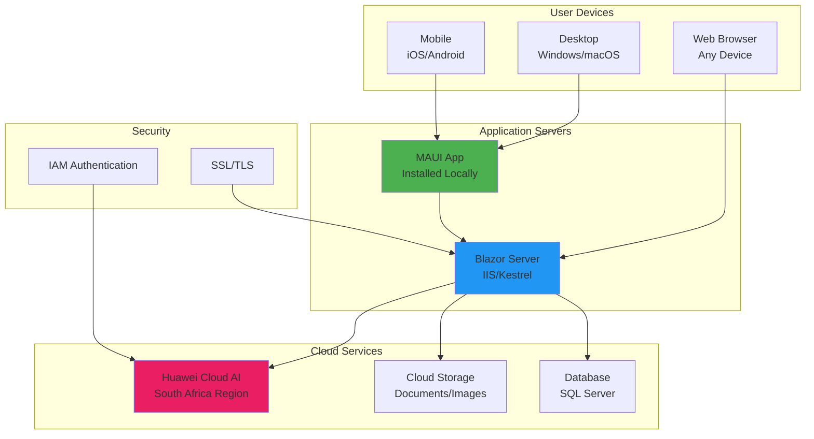

# PropTech Platform - Complete Overview

## Executive Summary

**PropMate** is an AI-powered property management platform that revolutionizes how property managers, landlords, and tenants interact. Built on .NET with dual interfaces (MAUI for desktop and Blazor for web), it integrates Huawei Cloud AI services to deliver intelligent property operations.

## Platform Vision

Transform property management from reactive to proactive through AI-driven insights, automated workflows, and seamless tenant experiences.

## Key Value Propositions

### For Property Managers
- **AI-Powered Screening**: Automated tenant risk assessment using Huawei Cloud Pangu LLM
- **Smart Pricing**: Dynamic rent recommendations based on market analysis
- **Predictive Maintenance**: Forecast property issues before they become expensive
- **Automated Documentation**: Generate leases and contracts instantly
- **Portfolio Analytics**: Real-time insights across entire property portfolio

### For Tenants
- **Transparent Process**: Clear application and screening process
- **Self-Service Portal**: Web-based access to statements, payments, maintenance
- **Quick Responses**: Faster approval and maintenance resolution
- **360° Tours**: Virtual property inspections before move-in
- **Digital Payments**: Easy online rent payment and history tracking

### For Landlords
- **Maximum ROI**: Optimized pricing and reduced vacancy
- **Risk Mitigation**: AI-powered tenant screening reduces defaults
- **Compliance**: Automated lease generation following SA Rental Housing Act
- **Transparency**: Real-time financial reporting and property status

## Technology Stack

### Frontend
- **.NET MAUI**: Native Windows/macOS/iOS/Android desktop application
- **Blazor Server**: Web application for browser-based access
- **XAML/Razor**: Modern UI frameworks

### Backend
- **ASP.NET Core**: Web API and services
- **C# 12**: Modern language features
- **.NET 8**: Latest framework

### AI/ML
- **Huawei Cloud Pangu**: Large language model for NLP tasks
- **Huawei ModelArts**: Predictive analytics and ML models
- **IAM Authentication**: Secure cloud integration

### Data
- **In-Memory DataStore**: Development/demo mode
- **Extensible**: Ready for SQL Server/PostgreSQL integration

## Platform Architecture

## Core Domain Model

### Entity Relationships

## User Personas

### 1. Property Manager (Primary User)
**Name**: Sarah, 35, experienced property manager  
**Goals**: Manage 50+ properties efficiently, minimize vacancy, reduce arrears  
**Pain Points**: Manual paperwork, tenant screening takes days, reactive maintenance  
**Tech Comfort**: High - uses Windows desktop daily  
**Primary Interface**: MAUI Desktop App

### 2. Tenant (Secondary User)
**Name**: John, 28, young professional  
**Goals**: Find quality housing, transparent process, quick maintenance response  
**Pain Points**: Unclear application status, slow responses, payment tracking  
**Tech Comfort**: Medium - smartphone and web browser  
**Primary Interface**: Blazor Web Portal

### 3. Landlord/Owner (Stakeholder)
**Name**: Michael, 52, property investor  
**Goals**: Maximize ROI, minimize risk, stay compliant  
**Pain Points**: Limited visibility, manual reports, trust in manager decisions  
**Tech Comfort**: Medium - prefers dashboards and reports  
**Primary Interface**: Web Portal (Reports View)

### 4. Maintenance Provider (Future User)
**Name**: David, 40, handyman/contractor  
**Goals**: Get work requests, update status, get paid promptly  
**Pain Points**: Unclear scope, payment delays, communication gaps  
**Tech Comfort**: Low-Medium - mobile-first  
**Primary Interface**: Mobile Web (Future)

## Key Features Overview

### 1. Tenant Management
- Registration and profile management
- Document upload and verification
- AI-powered risk screening
- Communication history
- Payment history tracking

### 2. Property Management
- Multi-type support (Room, House, Shack, Land)
- Virtual tours with 360° panoramas
- AI-powered inspection reports
- Maintenance tracking
- Occupancy status

### 3. Lease Management
- Dynamic lease generation
- Custom clauses per property type
- Electronic signatures (future)
- Renewal management
- Compliance with SA regulations

### 4. Financial Management
- Invoice generation
- Payment processing
- Statement generation
- Arrears tracking
- Financial reporting

### 5. AI Features
- Tenant screening and risk scoring
- Rental price optimization
- Predictive maintenance
- Portfolio analytics
- Lease clause generation

### 6. Marketplace (Future)
- Property listings
- Service provider directory
- Booking and scheduling
- Ratings and reviews
- Payment integration

## Platform Differentiators

### 1. AI-First Approach
Unlike traditional property management software, PropMate uses AI for decision support in every major workflow.

### 2. Dual Interface Strategy
Native desktop performance for power users, web accessibility for everyone else.

### 3. South African Market Focus
Built for SA regulations, market conditions, and property types (including shacks and informal housing).

### 4. 360° Virtual Tours
AI-powered visual inspection reduces physical site visits and improves transparency.

### 5. Agentic AI
Autonomous AI agent can analyze entire portfolio and generate actionable insights without human intervention.

## Deployment Architecture

## Performance Characteristics

### Response Times
- Page Load: < 2 seconds
- AI Screening: 5-10 seconds
- Document Generation: < 1 second
- Virtual Tour Processing: 30-60 seconds

### Scalability
- Properties: 1,000+ per instance
- Tenants: 5,000+ per instance
- Concurrent Users: 100+ simultaneous

### Availability
- Target: 99.5% uptime
- Planned Maintenance: Monthly windows
- Backup: Daily automated backups

## Security & Compliance

### Data Protection
- Encryption at rest and in transit
- POPIA compliance (SA data protection)
- Secure API authentication
- Role-based access control

### Audit Trail
- All actions logged with timestamp
- User identification on all changes
- Financial transaction tracking
- AI decision explanations

### Compliance
- SA Rental Housing Act
- Consumer Protection Act
- FICA regulations
- Tax reporting ready

## Integration Roadmap

### Phase 1 (Current)
- ✅ Huawei Cloud AI
- ✅ In-memory data storage
- ✅ Document generation

### Phase 2 (Q2 2026)
- 🔄 SQL Server database
- 🔄 Payment gateway (PayFast/Yoco)
- 🔄 SMS notifications

### Phase 3 (Q3 2026)
- 📋 Email service (SendGrid)
- 📋 WhatsApp Business API
- 📋 Electronic signatures

### Phase 4 (Q4 2026)
- 📋 Accounting software (Xero/Sage)
- 📋 Banking API integration
- 📋 Credit bureau integration

## Success Metrics

### Business Metrics
- Vacancy Rate: Target < 5%
- Arrears: Target < 10%
- Tenant Retention: Target > 60%
- Time to Lease: Target < 7 days

### User Metrics
- Property Manager Productivity: 2x improvement
- Tenant Satisfaction: Target > 4.5/5
- Response Time: Target < 24 hours
- Platform Adoption: Target 80% within 6 months

### Technical Metrics
- System Uptime: 99.5%
- AI Accuracy: > 85% for predictions
- Page Load Time: < 2 seconds
- Error Rate: < 0.1%

## Support & Training

### Documentation
- User manuals for MAUI and Web
- Video tutorials
- API documentation
- FAQ and troubleshooting guides

### Training
- Initial setup and onboarding (4 hours)
- Power user training (8 hours)
- Administrator training (16 hours)
- Ongoing webinars (monthly)

### Support Channels
- Email support (24-hour response)
- WhatsApp support (business hours)
- Phone support (critical issues)
- Online ticketing system

## Conclusion

PropMate represents the future of property management in South Africa - combining local market knowledge with cutting-edge AI technology to deliver better outcomes for property managers, tenants, and landlords alike.
