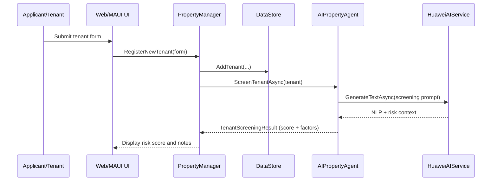
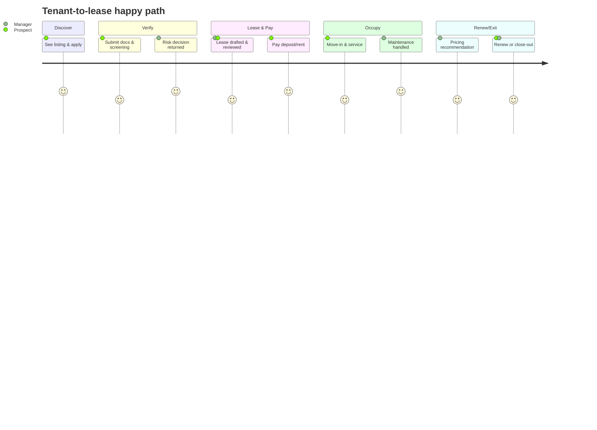
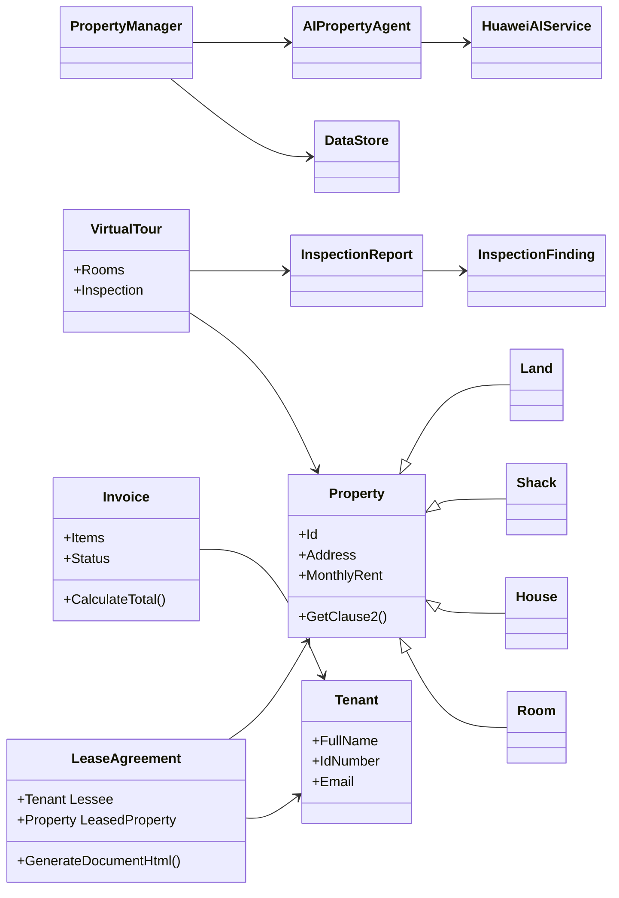

# Code4Mzansi Competition Brief

This note summarises how the PropTech prototype is positioned for the **Code4Mzansi** competition: what it does, how it works, the core workflows and journey, plus a quick evaluation and improvement opportunities.

## 1) Simple description — how it works

- **What it is:** A property operations co-pilot (“PropMate”) that unifies tenant onboarding, lease generation, billing, and maintenance into one AI-assisted workflow.
- **Interfaces:** .NET MAUI desktop for property managers and ASP.NET Core Blazor for the web; both share the same Models/Services layer.
- **Data flow:** DataStore keeps tenants, properties, leases, invoices, and virtual tours. PropertyManager orchestrates actions; AIPropertyAgent and HuaweiAIService deliver tenant screening, pricing, predictive maintenance, and AI clause generation.
- **Outputs:** Dynamic lease documents, invoices/statements, AI insights, and inspection reports that can be shared with tenants and owners.

### Visual: high-level system view

```mermaid
flowchart LR
    subgraph Client
        MAUI[.NET MAUI\nProperty manager app]
        Blazor[Blazor Web\nTenant/Agent portal]
    end

    MAUI --> PM[PropertyManager\n(Services layer)]
    Blazor --> PM

    subgraph Core
        PM --> DS[DataStore\nTenants/Properties/Leases/Invoices]
        PM --> AI[AIPropertyAgent]
        AI --> HWS[HuaweiAIService]
    end

    subgraph HuaweiCloud[Huawei Cloud AI]
        Pangu[Pangu LLM]
        ModelArts[ModelArts prediction]
    end

    HWS --> Pangu
    HWS --> ModelArts
```

## 2) Core workflows

| Workflow | Steps | Output |
| --- | --- | --- |
| Tenant onboarding & screening | Capture tenant form → add to DataStore → AIPropertyAgent screens via HuaweiAIService → risk score returned | Screened tenant profile with risk factors |
| Lease creation & billing | Select tenant + property → PropertyManager creates LeaseAgreement → GenerateDocumentHtml → IssueInvoice | Lease pack (HTML) + initial invoice for deposit/rent |
| Maintenance & inspections | Log issue or schedule virtual tour → AIPropertyAgent analyses panoramas → InspectionReport created with findings/costs | Prioritised maintenance list with estimated costs |
| Portfolio analytics | Run RunPortfolioAnalysisAsync → AI insights stored in DataStore → surfaced in dashboards | Portfolio recommendations (pricing, arrears, occupancy) |

### Visual: Tenant onboarding & screening workflow



## 3) Journey map (happy path)

| Stage | Actor & goal | Key actions | Touchpoints | Success signals |
| --- | --- | --- | --- | --- |
| Discover | Prospect wants to apply | Completes tenant form | Web (Blazor) or assisted capture in MAUI | Form submitted; documents uploaded |
| Verify | Manager wants risk clarity | AI screening + reference checks | AIPropertyAgent + HuaweiAIService | Risk score + recommendation ready |
| Lease & pay | Both want agreement and payment | Generate lease; issue invoice for deposit/rent | LeaseAgreement HTML; invoice email/download | Deposit paid; lease accepted |
| Occupy & serve | Tenant wants smooth stay | Maintenance tickets + virtual tour checks | Blazor self-service; AI inspection reports | Low MTTR; satisfaction feedback |
| Renew/Exit | Decide next step | Pricing recommendation; close-out inspection | AI pricing + final inspection report | Renewal/exit decision with costs known |

### Visual: User journey (happy path)



## 4) Evaluation & review

- **Readiness:** Flows and models are defined end-to-end; MAUI/Blazor split supports both manager desktop and tenant web experiences. Demo-friendly via in-memory DataStore.
- **Differentiation:** AI tenant screening, AI lease clause drafting, predictive maintenance from 360° tours, and portfolio-wide agentic insights.
- **Feasibility:** Uses .NET stack with clear separation of concerns; Huawei Cloud AI is abstracted for offline/demo use while keeping a production-ready contract.
- **Risks to watch:** Connectivity for AI calls, data privacy for tenant documents, and change management for agents adopting AI guidance.

## 5) Areas for improvement

- Add automated export of lease/statement PDFs for submission-ready bundles.
- Expand tenant self-service (payments status, maintenance chat, renewal offers) in Blazor.
- Include scoring explanations and adverse-action logging for AI screening transparency.
- Add service-level dashboards: MTTR, arrears ageing, occupancy, and rent uplift tracking.
- Pilot real payments integration and SMS/WhatsApp notifications for low-connectivity scenarios.

### Visual: Relationships (domain model)


