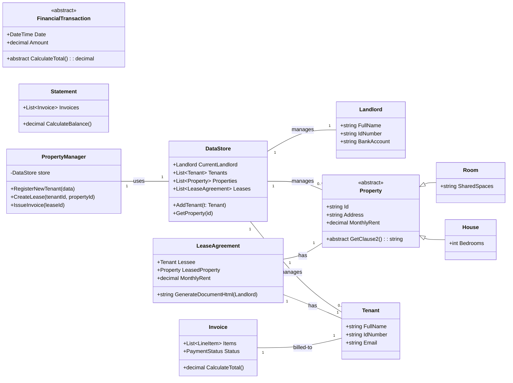
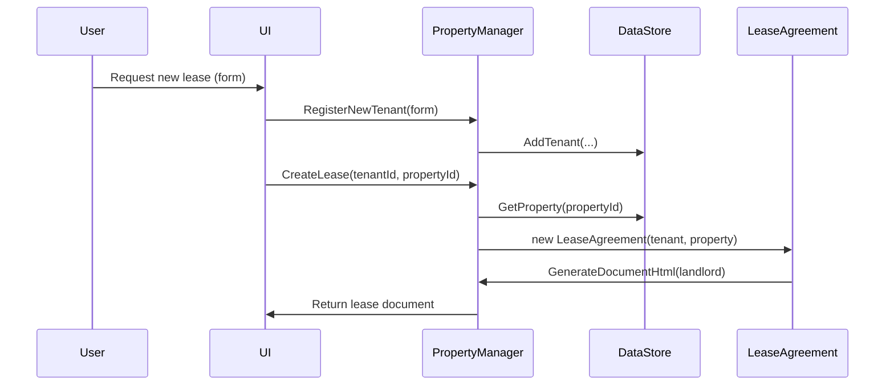
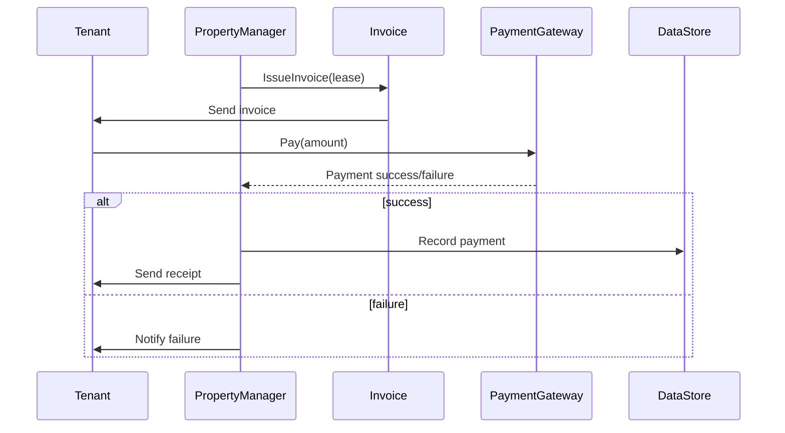

# PropTech Prototype — Diagrams

Below are Mermaid diagrams that represent the main domain classes and two typical flows: lease generation and invoicing/payment.

## Class Diagram (Mermaid)

## Sequence Diagram (Mermaid) — Lease Generation Flow

## Sequence Diagram (Mermaid) — Invoice & Payment Flow

