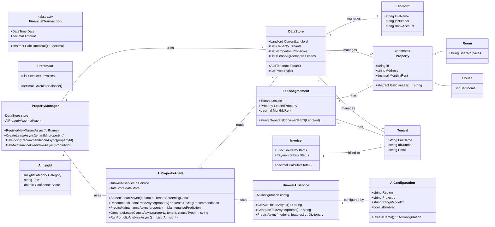
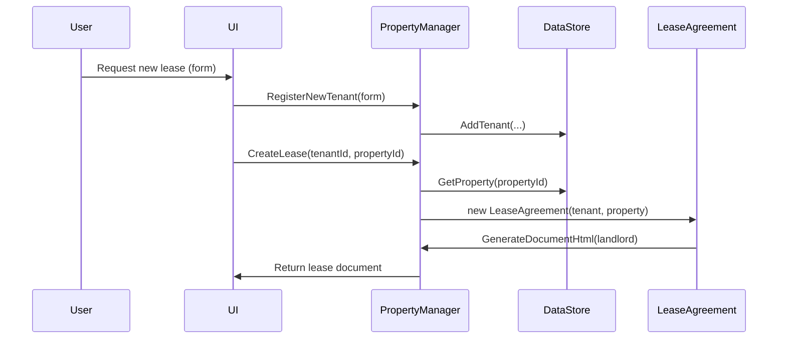
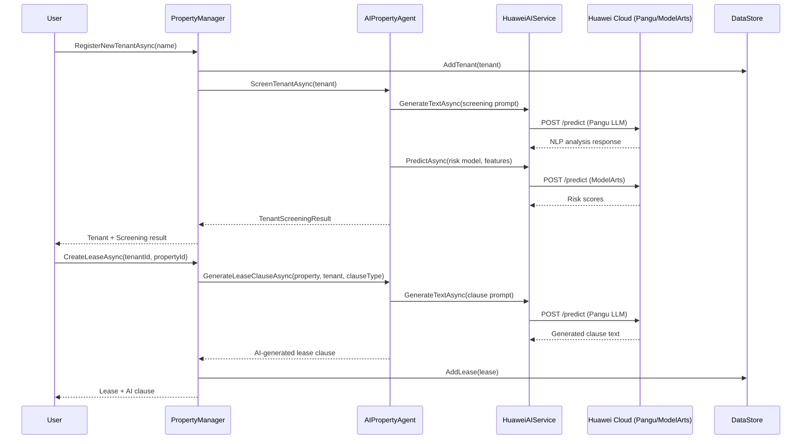
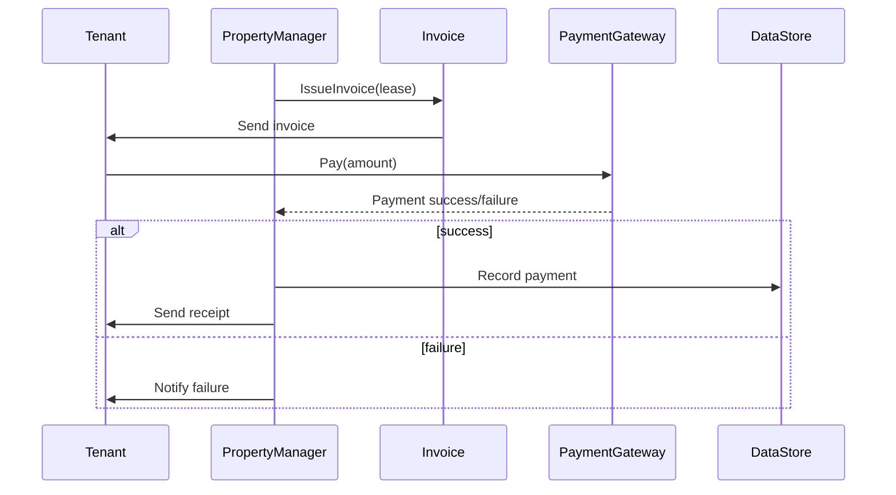

# PropTech Prototype — Diagrams

Below are Mermaid diagrams that represent the main domain classes, AI services, and typical flows: lease generation, invoicing/payment, and AI-powered workflows.

## Class Diagram (Mermaid)

## Sequence Diagram (Mermaid) — Lease Generation Flow

## Sequence Diagram (Mermaid) — AI-Powered Tenant Screening & Lease Creation

## Sequence Diagram (Mermaid) — Invoice & Payment Flow

