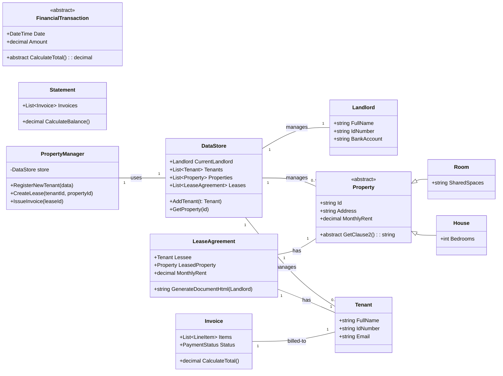
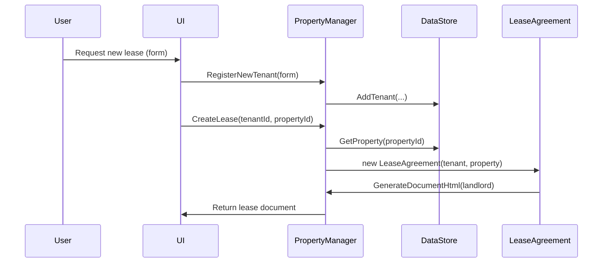
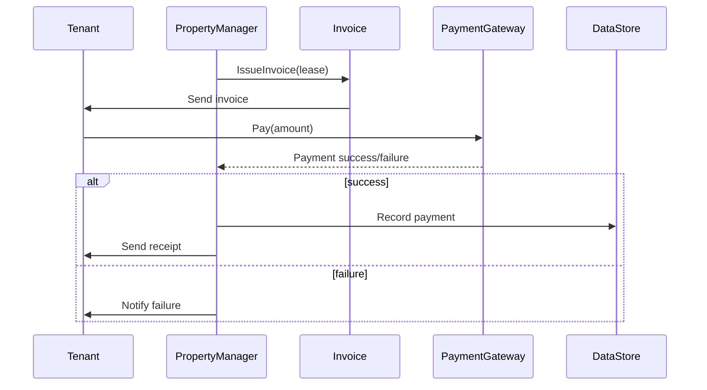

# PROPTECH

**Diagrams:** See `DIAGRAMS.md` for Mermaid source, or open `PropTechPrototype/diagrams/` to view exported SVGs (if generated).

The project you are creating is a **PropTech (Property Technology) Web Application Prototype** developed using Object-Oriented principles. It is specifically designed as a **Data-Driven Business Logic Application**, where the core functionality revolves around managing data entities (Tenant, Property, Financials) and generating complex documents from that data.

Here is the comprehensive plan, project structure, and detailed iteration breakdown.

## I. PropMate Program Description and Architecture

### A. Program Overview and Features

| Category        | Feature                                    | Rationale / Document Context                                                                                                                          |
| :-------------: | :----------------------------------------: | :---------------------------------------------------------------------------------------------------------------------------------------------------: |
| **Data Model**  | Diverse Property Types                     | Must support **Room, Shack, House, and Land**, each with unique lease terms.                                                                          |
| **Tenant Flow** | Comprehensive Tenant Registration          | Gathers Personal, Employment, Occupant, and Emergency data for a complete tenant profile.                                                             |
| **Financials**  | Invoice and Statement Generation           | Creates bills (Invoices) and monthly summaries (Statements) incorporating Rent, Deposit, and line items like Electricity (in South African Rand (R)). |
| **Documenting** | Dynamic Print-Friendly Document Generation | Generates Lease Agreements and Statements using a "Print View" modal (HTML styled as A4 paper), avoiding complex PDF generation.                      |

### B. Architecture and OOP Rationale

The architecture is layered (Model/Service/Data) to strictly adhere to the Single Responsibility Principle (SRP).

| Layer       | Key Classes                                                                      | OOP Principle Focus (Why this structure)                                                                                                                                                                                                                                                                                                                                                                                                                                                                                                                                                                |
| :---------: | :------------------------------------------------------------------------------: | :-----------------------------------------------------------------------------------------------------------------------------------------------------------------------------------------------------------------------------------------------------------------------------------------------------------------------------------------------------------------------------------------------------------------------------------------------------------------------------------------------------------------------------------------------------------------------------------------------------: |
| **Model**   | **\`\`\`Property\`\`\`**, **\`\`\`Tenant\`\`\`**, **\`\`\`LeaseAgreement\`\`\`** | **Encapsulation:** All data classes use private setters (e.g., \`\`\` { get; private set; } \`\`\`), ensuring data integrity and requiring changes only through controlled public methods (e.g., \`\`\` UpdateDetails() \`\`\`). **Inheritance & Polymorphism:** The abstract \`\`\` Property \`\`\` class allows the \`\`\` LeaseAgreement \`\`\` to treat all property types equally while calling type-specific logic (\`\`\` GetClause2() \`\`\`) to generate customized content. **Composition:** \`\`\` LeaseAgreement \`\`\` is composed of a \`\`\` Tenant \`\`\` and a \`\`\` Property \`\`\`. |
| **Service** | **\`\`\`PropertyManager\`\`\`**                                                  | **Single Responsibility Principle (SRP):** This class contains all the business logic (\`\`\` CreateLease() \`\`\`, \`\`\` RegisterNewTenant() \`\`\`). It coordinates actions between the data objects and the data store.                                                                                                                                                                                                                                                                                                                                                                             |
| **Data**    | **\`\`\`DataStore\`\`\`**                                                        | **Encapsulation:** The sole access point for all in-memory data (simulating a database). It manages collections of all core entities (\`\`\` Tenants \`\`\`, \`\`\` Properties \`\`\`, etc.).                                                                                                                                                                                                                                                                                                                                                                                                           |

## II. UML Class Diagram (Text Representation)

```cs
classDiagram
    direction LR

    class DataStore {
        + Landlord CurrentLandlord
        + List<Tenant> Tenants
        + List<Property> Properties
        + List<LeaseAgreement> Leases
        + AddTenant(Tenant t)
        + GetProperty(id)
    }
    
    class Landlord {
        + FullName
        + IdNumber
        + BankAccount BankDetails
    }

    class Property {
        <<abstract>>
        + Id : string
        + Address : string
        + PropertyType : abstract string
        + abstract GetClause2() : string
        + abstract GetAnnexureA() : string
    }
    
    class Room {
        + override PropertyType = "Room"
        + SharedSpaces : string
    }
    
    class Tenant {
        + FullName
        + IdNumber
        + Email
        + Status : TenantStatus
    }
    
    class LeaseAgreement {
        + Tenant Lessee
        + Property LeasedProperty
        + MonthlyRent : decimal
        + GenerateDocumentHtml(Landlord) : string
    }

    class FinancialTransaction {
        <<abstract>>
        + Date
        + Amount
        + abstract CalculateTotal() : decimal
    }
    
    class Invoice {
        + List<LineItem> Items
        + PaymentStatus Status
        + override CalculateTotal()
    }

    class PropertyManager {
        - DataStore store
        + RegisterNewTenant(FormData)
        + CreateLease(tenantId, propertyId) : LeaseAgreement
        + IssueInvoice(leaseId) : Invoice
    }

    Property <|-- Room : Inheritance (is-a)
    FinancialTransaction <|-- Invoice : Inheritance (is-a)
    
    DataStore "1" -- "1" Landlord : Composition (manages)
    DataStore "1" -- "0..*" Tenant : Composition (manages)
    DataStore "1" -- "0..*" Property : Composition (manages)
    
    PropertyManager "1" -- "1" DataStore : Dependency (uses)
    
    LeaseAgreement "1" -- "1" Tenant : Composition (has)
    LeaseAgreement "1" -- "1" Property : Composition (has)
    
    Invoice "1" -- "1" Tenant : Association

```

## III. Iterative Development Plan and Guide

### A. Project Structure Suggestion

For a C\# console or web application prototype, this structure is recommended.

```text
PropMateProject/
├── Models/                 (The core data classes)
│   ├── Landlord.cs
│   ├── Tenant.cs
│   ├── Property.cs         (Base/Abstract Class)
│   ├── Room.cs             (Concrete Class - V1 Focus)
│   ├── LeaseAgreement.cs
│   ├── FinancialTransaction.cs (Base/Abstract Class)
│   └── Invoice.cs
├── Services/               (The business logic and data access)
│   ├── DataStore.cs        (In-memory storage and retrieval)
│   └── PropertyManager.cs  (Main application controller)
├── Templates/              (The source of your lease HTML/text)
│   └── RoomLeaseTemplate.html
└── Program.cs              (The application entry point)

```

### B. Iteration V1 (MVP Goal: Generate Room Lease, Register Tenant, Issue Invoice)

| Step  | Task                    | Classes/Methods to Build                                                                                | Detailed Guide & OOP Focus                                                                                                                                                                                                                                                              |
| :---: | :---------------------: | :-----------------------------------------------------------------------------------------------------: | :-------------------------------------------------------------------------------------------------------------------------------------------------------------------------------------------------------------------------------------------------------------------------------------: |
| **1** | **Foundation Setup**    | \`\`\` Landlord \`\`\`, \`\`\` DataStore \`\`\`, \`\`\` Tenant \`\`\`                                   | Create \`\`\` DataStore \`\`\` to hold initial lists. Instantiate a \`\`\` Landlord \`\`\` object. **Focus: Encapsulation** in all core classes using private setters.                                                                                                                  |
| **2** | **Tenant Registration** | \`\`\` PropertyManager.RegisterNewTenant() \`\`\`                                                       | Implement \`\`\` RegisterNewTenant() \`\`\` to create a \`\`\` Tenant \`\`\` instance from form data and add it to \`\`\` DataStore \`\`\`. **Focus: SRP** (PropertyManager handles the registration logic).                                                                            |
| **3** | **Room Polymorphism**   | \`\`\` Property \`\`\` (Abstract), \`\`\` Room \`\`\` (Concrete)                                        | Define **abstract** methods in \`\`\` Property \`\`\` (\`\`\` GetClause2() \`\`\`). Implement the concrete versions in \`\`\` Room \`\`\` to return the Room-specific text from your template. **Focus: Inheritance & Polymorphism**.                                                   |
| **4** | **Lease Generation**    | \`\`\` LeaseAgreement \`\`\`, \`\`\` PropertyManager.CreateLease() \`\`\`                               | Implement the \`\`\` GenerateDocumentHtml(Landlord) \`\`\` method in \`\`\` LeaseAgreement \`\`\`. This method uses the Master Template structure to combine: Tenant, Landlord, fixed clauses, and polymorphic clauses from the **Room** object. **Focus: Composition & Polymorphism**. |
| **5** | **Issue Invoice**       | \`\`\` FinancialTransaction \`\`\`, \`\`\` Invoice \`\`\`, \`\`\` PropertyManager.IssueInvoice() \`\`\` | Implement the base \`\`\` FinancialTransaction \`\`\` and the derived \`\`\` Invoice \`\`\` class. \`\`\` IssueInvoice() \`\`\` creates a new Invoice object with line items for Rent and Deposit. **Focus: Abstraction & Inheritance**.                                                |

### C. Iteration V2 (Expansion and Feature Completion)

V2 focuses on completing the full document and financial model.

| Feature Area            | V2 Goal                                        | Classes to Build                                                                                                                 | OOP Focus                                                                                                                                                                               |
| :---------------------: | :--------------------------------------------: | :------------------------------------------------------------------------------------------------------------------------------: | :-------------------------------------------------------------------------------------------------------------------------------------------------------------------------------------: |
| **Property Model**      | Fully support all types: House, Shack, Land.   | New concrete classes: \`\`\` House \`\`\`, \`\`\` Shack \`\`\`, \`\`\` Land \`\`\`.                                              | **Polymorphism:** Each must override lease-generation methods to provide its unique clauses and annexures (e.g., Shack's prepaid electricity).                                          |
| **Financial System**    | Full expense, payment, and statement tracking. | **\`\`\` Statement \`\`\`** (Composition), **\`\`\` UtilityPurchase \`\`\`** (Inherits \`\`\` FinancialTransaction \`\`\`).      | **Composition:** \`\`\` Statement \`\`\` aggregates many \`\`\` Invoice \`\`\` and \`\`\` Payment \`\`\` objects. **Inheritance:** Utility Purchase is a type of Financial Transaction. |
| **Dashboard/Reporting** | Calculate key metrics.                         | Expand \`\`\` PropertyManager \`\`\` with methods like \`\`\` CalculateOccupancyRate() \`\`\`, \`\`\` GetArrearsReport() \`\`\`. | **SRP:** Separate financial and reporting logic into dedicated methods within the Service layer.                                                                                        |

## PropTech Prototype — UML Diagrams

Below are Mermaid diagrams that represent the main domain classes and two typical flows: lease generation and invoicing/payment.

### Class Diagram (Mermaid)



## Sequence Diagram (Mermaid) — Lease Generation Flow



### Sequence Diagram (Mermaid) — Invoice & Payment Flow


