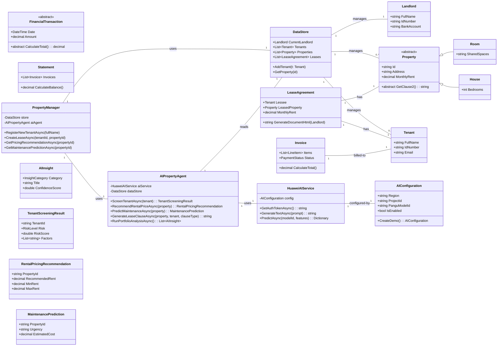
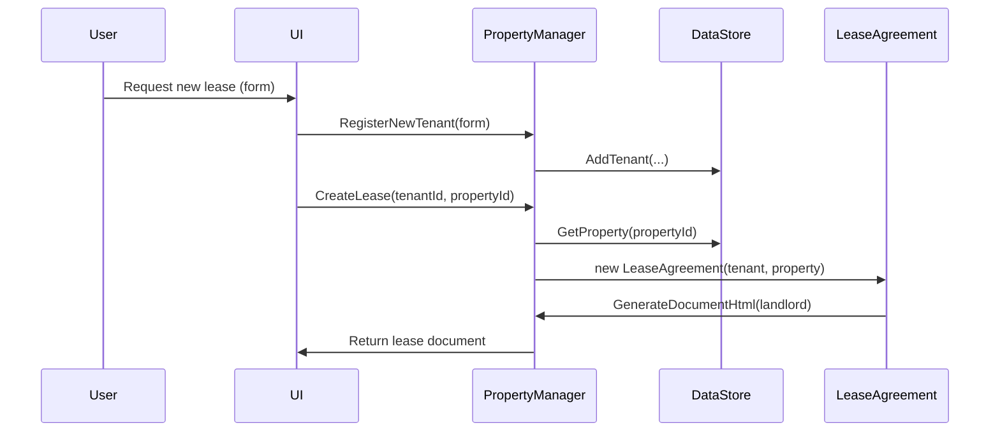
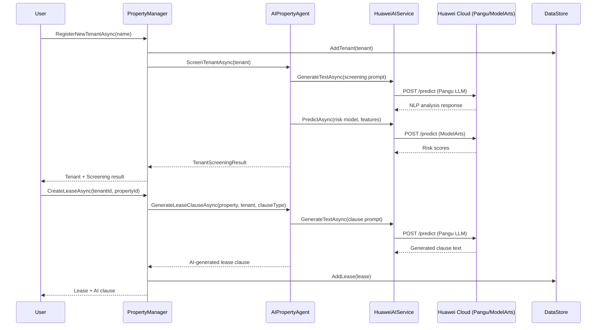
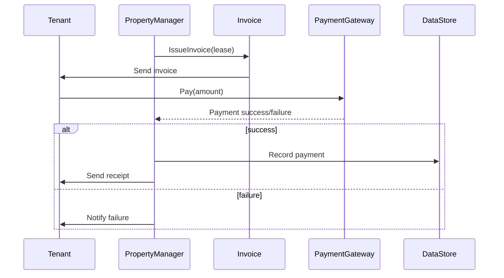

# PROPTECH

> **⚠️ PROTOTYPE STATUS:** This is a working prototype demonstrating AI-powered property management concepts. See [REVIEW_INDEX.md](../REVIEW_INDEX.md) for comprehensive platform assessment.

**Competition Review:** See [REVIEW_INDEX.md](../REVIEW_INDEX.md) for complete Code4Mzansi competition analysis, presentation guide, and technical roadmap.
**Diagrams:** See `DIAGRAMS.md` for Mermaid source, or open `PropTechPrototype/diagrams/` to view exported SVGs (if generated).
**Code4Mzansi brief:** See `CODE4MZANSI.md` for workflows, journey map, evaluation, and improvement notes.
**Marketplace:** The brief now includes marketplace flows (listing, discovery, AI recommendations, booking) and diagrams.

The project you are creating is a **PropTech (Property Technology) Web Application Prototype** developed using Object-Oriented principles. It is specifically designed as a **Data-Driven Business Logic Application**, where the core functionality revolves around managing data entities (Tenant, Property, Financials) and generating complex documents from that data.

**AI-Powered:** The platform integrates **Huawei Cloud AI** (Pangu large language models via ModelArts) to deliver intelligent, agentic property management capabilities including automated tenant screening, rental pricing optimisation, predictive maintenance, and AI-generated lease clauses.

## Framework Strategy: .NET MAUI (Desktop) + ASP.NET Core Blazor (Web)

This project uses **both .NET MAUI and ASP.NET Core Blazor** — each for its strength:

| Capability | .NET MAUI Desktop ✅ | ASP.NET Core Blazor ✅ |
|---|---|---|
| **Platform** | Native **Windows desktop app** (also supports Android, iOS, macOS) | Web application accessible from any browser |
| **Best for** | Property managers who want a fast, native desktop experience | Tenants, agents, and remote access from any device |
| **Offline support** | Runs natively, can work offline | Requires server connection |
| **Performance** | Native UI controls, fast startup, full OS integration | Server-rendered or WebAssembly, browser-dependent |
| **Installation** | Installed on Windows (no app store required for sideloading) | No installation — just open a URL |
| **AI integration** | Same Huawei Cloud AI services (shared C# codebase) | Same Huawei Cloud AI services (shared C# codebase) |

### Why both?

- **.NET MAUI** is ideal for the **property manager's daily workflow** on a Windows desktop — fast native app with taskbar integration, system notifications, and offline capability.
- **ASP.NET Core Blazor** provides **browser-based access** for tenants checking statements, agents accessing the platform remotely, and scenarios where installing an app isn't practical.
- Both share the **same Models and Services** (DataStore, PropertyManager, HuaweiAIService, AIPropertyAgent) — the business logic and AI integration are written once in C# and reused across both interfaces.

### Project layout

| Directory | Framework | Purpose |
|---|---|---|
| `PropTechPrototype/` | .NET Console | Original CLI prototype |
| `PropTechMaui/` | .NET MAUI | Native **Windows desktop** application |
| `PropTechWeb/` | ASP.NET Core Blazor | Web application (browser-based) |

> **Building the MAUI app:** Open `PropTechMaui/PropTechMaui.csproj` in Visual Studio 2022+ on Windows and select the **Windows Machine** target. The MAUI workload must be installed via the Visual Studio Installer.

Here is the comprehensive plan, project structure, and detailed iteration breakdown.

## I. PropMate Program Description and Architecture

### A. Program Overview and Features

| Category        | Feature                                    | Rationale / Document Context                                                                                                                          |
| :-------------: | :----------------------------------------: | :---------------------------------------------------------------------------------------------------------------------------------------------------: |
| **Data Model**  | Diverse Property Types                     | Must support **Room, Shack, House, and Land**, each with unique lease terms.                                                                          |
| **Tenant Flow** | Comprehensive Tenant Registration          | Gathers Personal, Employment, Occupant, and Emergency data for a complete tenant profile.                                                             |
| **Financials**  | Invoice and Statement Generation           | Creates bills (Invoices) and monthly summaries (Statements) incorporating Rent, Deposit, and line items like Electricity (in South African Rand (R)). |
| **Documenting** | Dynamic Print-Friendly Document Generation | Generates Lease Agreements and Statements using a "Print View" modal (HTML styled as A4 paper), avoiding complex PDF generation.                      |
| **AI**          | Huawei Cloud AI Integration                | Agentic AI powered by Huawei Cloud Pangu models for tenant screening, rental pricing, maintenance prediction, and lease clause generation.            |
| **360° Tours**  | Virtual Tour & AI Inspection               | 360° room panoramas with AI-powered visual inspection — detects defects, scores property condition, and estimates repair costs per room.              |

### B. Architecture and OOP Rationale

The architecture is layered (Model/Service/Data) to strictly adhere to the Single Responsibility Principle (SRP).

| Layer       | Key Classes                                                                      | OOP Principle Focus (Why this structure)                                                                                                                                                                                                                                                                                                                                                                                                                                                                                                                                                                |
| :---------: | :------------------------------------------------------------------------------: | :-----------------------------------------------------------------------------------------------------------------------------------------------------------------------------------------------------------------------------------------------------------------------------------------------------------------------------------------------------------------------------------------------------------------------------------------------------------------------------------------------------------------------------------------------------------------------------------------------------: |
| **Model**   | **\`\`\`Property\`\`\`**, **\`\`\`Tenant\`\`\`**, **\`\`\`LeaseAgreement\`\`\`**, **\`\`\`AIInsight\`\`\`**, **\`\`\`AIConfiguration\`\`\`** | **Encapsulation:** All data classes use private setters (e.g., \`\`\` { get; private set; } \`\`\`), ensuring data integrity and requiring changes only through controlled public methods (e.g., \`\`\` UpdateDetails() \`\`\`). **Inheritance & Polymorphism:** The abstract \`\`\` Property \`\`\` class allows the \`\`\` LeaseAgreement \`\`\` to treat all property types equally while calling type-specific logic (\`\`\` GetClause2() \`\`\`) to generate customized content. **Composition:** \`\`\` LeaseAgreement \`\`\` is composed of a \`\`\` Tenant \`\`\` and a \`\`\` Property \`\`\`. |
| **Service** | **\`\`\`PropertyManager\`\`\`**, **\`\`\`AIPropertyAgent\`\`\`**, **\`\`\`HuaweiAIService\`\`\`** | **Single Responsibility Principle (SRP):** \`\`\` PropertyManager \`\`\` coordinates business operations. \`\`\` AIPropertyAgent \`\`\` handles agentic AI decision-making (plan-act-observe loop). \`\`\` HuaweiAIService \`\`\` manages Huawei Cloud API communication. |
| **Data**    | **\`\`\`DataStore\`\`\`**                                                        | **Encapsulation:** The sole access point for all in-memory data (simulating a database). It manages collections of all core entities (\`\`\` Tenants \`\`\`, \`\`\` Properties \`\`\`, etc.).                                                                                                                                                                                                                                                                                                                                                                                                           |

## II. UML Class Diagram (Text Representation)

```cs
classDiagram
    direction LR

    class DataStore {
        + Landlord CurrentLandlord
        + List<Tenant> Tenants
        + List<Property> Properties
        + List<LeaseAgreement> Leases
        + AddTenant(Tenant t)
        + GetProperty(id)
    }
    
    class Landlord {
        + FullName
        + IdNumber
        + BankAccount BankDetails
    }

    class Property {
        <<abstract>>
        + Id : string
        + Address : string
        + PropertyType : abstract string
        + abstract GetClause2() : string
        + abstract GetAnnexureA() : string
    }
    
    class Room {
        + override PropertyType = "Room"
        + SharedSpaces : string
    }
    
    class Tenant {
        + FullName
        + IdNumber
        + Email
        + Status : TenantStatus
    }
    
    class LeaseAgreement {
        + Tenant Lessee
        + Property LeasedProperty
        + MonthlyRent : decimal
        + GenerateDocumentHtml(Landlord) : string
    }

    class FinancialTransaction {
        <<abstract>>
        + Date
        + Amount
        + abstract CalculateTotal() : decimal
    }
    
    class Invoice {
        + List<LineItem> Items
        + PaymentStatus Status
        + override CalculateTotal()
    }

    class PropertyManager {
        - DataStore store
        + RegisterNewTenant(FormData)
        + CreateLease(tenantId, propertyId) : LeaseAgreement
        + IssueInvoice(leaseId) : Invoice
    }

    Property <|-- Room : Inheritance (is-a)
    FinancialTransaction <|-- Invoice : Inheritance (is-a)
    
    DataStore "1" -- "1" Landlord : Composition (manages)
    DataStore "1" -- "0..*" Tenant : Composition (manages)
    DataStore "1" -- "0..*" Property : Composition (manages)
    
    PropertyManager "1" -- "1" DataStore : Dependency (uses)
    
    LeaseAgreement "1" -- "1" Tenant : Composition (has)
    LeaseAgreement "1" -- "1" Property : Composition (has)
    
    Invoice "1" -- "1" Tenant : Association

```

## III. Iterative Development Plan and Guide

### A. Project Structure

The shared Models/Services architecture is used by all three project interfaces:

```text
propTech/
├── PropTechPrototype/      (Console prototype — original CLI demo)
│   ├── Models/
│   ├── Services/
│   ├── Templates/
│   └── Program.cs
│
├── PropTechMaui/           (.NET MAUI — native Windows desktop app)
│   ├── Models/             (Shared AI models)
│   ├── Services/           (Shared AI services)
│   ├── Pages/              (XAML pages: Dashboard, Properties, Tenants, Leases, Maintenance)
│   ├── Resources/          (Styles, Colors)
│   ├── MauiProgram.cs      (DI + service registration)
│   └── AppShell.xaml       (Navigation shell)
│
├── PropTechWeb/            (Blazor — web application)
│   ├── Models/             (Shared AI models)
│   ├── Services/           (Shared AI services)
│   ├── Components/Pages/   (Razor pages: Dashboard, Properties, Tenants, Leases, Maintenance)
│   └── Program.cs          (DI + service registration)
│
├── PropManagement system.pdf
└── Tenant_Information_Form_Updated.docx

```

### B. Iteration V1 (MVP Goal: Generate Room Lease, Register Tenant, Issue Invoice)

| Step  | Task                    | Classes/Methods to Build                                                                                | Detailed Guide & OOP Focus                                                                                                                                                                                                                                                              |
| :---: | :---------------------: | :-----------------------------------------------------------------------------------------------------: | :-------------------------------------------------------------------------------------------------------------------------------------------------------------------------------------------------------------------------------------------------------------------------------------: |
| **1** | **Foundation Setup**    | \`\`\` Landlord \`\`\`, \`\`\` DataStore \`\`\`, \`\`\` Tenant \`\`\`                                   | Create \`\`\` DataStore \`\`\` to hold initial lists. Instantiate a \`\`\` Landlord \`\`\` object. **Focus: Encapsulation** in all core classes using private setters.                                                                                                                  |
| **2** | **Tenant Registration** | \`\`\` PropertyManager.RegisterNewTenant() \`\`\`                                                       | Implement \`\`\` RegisterNewTenant() \`\`\` to create a \`\`\` Tenant \`\`\` instance from form data and add it to \`\`\` DataStore \`\`\`. **Focus: SRP** (PropertyManager handles the registration logic).                                                                            |
| **3** | **Room Polymorphism**   | \`\`\` Property \`\`\` (Abstract), \`\`\` Room \`\`\` (Concrete)                                        | Define **abstract** methods in \`\`\` Property \`\`\` (\`\`\` GetClause2() \`\`\`). Implement the concrete versions in \`\`\` Room \`\`\` to return the Room-specific text from your template. **Focus: Inheritance & Polymorphism**.                                                   |
| **4** | **Lease Generation**    | \`\`\` LeaseAgreement \`\`\`, \`\`\` PropertyManager.CreateLease() \`\`\`                               | Implement the \`\`\` GenerateDocumentHtml(Landlord) \`\`\` method in \`\`\` LeaseAgreement \`\`\`. This method uses the Master Template structure to combine: Tenant, Landlord, fixed clauses, and polymorphic clauses from the **Room** object. **Focus: Composition & Polymorphism**. |
| **5** | **Issue Invoice**       | \`\`\` FinancialTransaction \`\`\`, \`\`\` Invoice \`\`\`, \`\`\` PropertyManager.IssueInvoice() \`\`\` | Implement the base \`\`\` FinancialTransaction \`\`\` and the derived \`\`\` Invoice \`\`\` class. \`\`\` IssueInvoice() \`\`\` creates a new Invoice object with line items for Rent and Deposit. **Focus: Abstraction & Inheritance**.                                                |

### C. Iteration V2 (Expansion and Feature Completion)

V2 focuses on completing the full document and financial model.

| Feature Area            | V2 Goal                                        | Classes to Build                                                                                                                 | OOP Focus                                                                                                                                                                               |
| :---------------------: | :--------------------------------------------: | :------------------------------------------------------------------------------------------------------------------------------: | :-------------------------------------------------------------------------------------------------------------------------------------------------------------------------------------: |
| **Property Model**      | Fully support all types: House, Shack, Land.   | New concrete classes: \`\`\` House \`\`\`, \`\`\` Shack \`\`\`, \`\`\` Land \`\`\`.                                              | **Polymorphism:** Each must override lease-generation methods to provide its unique clauses and annexures (e.g., Shack's prepaid electricity).                                          |
| **Financial System**    | Full expense, payment, and statement tracking. | **\`\`\` Statement \`\`\`** (Composition), **\`\`\` UtilityPurchase \`\`\`** (Inherits \`\`\` FinancialTransaction \`\`\`).      | **Composition:** \`\`\` Statement \`\`\` aggregates many \`\`\` Invoice \`\`\` and \`\`\` Payment \`\`\` objects. **Inheritance:** Utility Purchase is a type of Financial Transaction. |
| **Dashboard/Reporting** | Calculate key metrics.                         | Expand \`\`\` PropertyManager \`\`\` with methods like \`\`\` CalculateOccupancyRate() \`\`\`, \`\`\` GetArrearsReport() \`\`\`. | **SRP:** Separate financial and reporting logic into dedicated methods within the Service layer.                                                                                        |

### D. Iteration V3 — AI & Agentic AI (Huawei Cloud Integration)

V3 introduces intelligent, AI-driven property management powered by **Huawei Cloud AI** services.

| Feature Area                     | V3 Goal                                                       | Classes Built                                                     | AI / OOP Focus                                                                                                                                          |
| :------------------------------: | :-----------------------------------------------------------: | :---------------------------------------------------------------: | :-----------------------------------------------------------------------------------------------------------------------------------------------------: |
| **Huawei Cloud Integration**     | Connect to Pangu LLM and ModelArts prediction APIs            | `HuaweiAIService`                                                 | **Encapsulation:** API credentials and tokens managed internally. Supports both live API and offline demo mode.                                         |
| **Agentic AI Orchestrator**      | Autonomous property management agent                          | `AIPropertyAgent`                                                 | **SRP + Strategy Pattern:** Agent follows plan-act-observe loop, delegating to specialised AI methods for each domain task.                             |
| **AI Tenant Screening**          | Risk-score tenants using NLP and prediction models            | `TenantScreeningResult`, `AIPropertyAgent.ScreenTenantAsync()`    | **Composition:** Combines NLP analysis (Pangu) with numerical risk prediction (ModelArts) for a comprehensive screening result.                        |
| **AI Rental Pricing**            | Optimal rent recommendations with market analysis             | `RentalPricingRecommendation`, `AIPropertyAgent.RecommendRentalPriceAsync()` | **Data-Driven:** Analyses property attributes and market signals to recommend pricing ranges with confidence scores.                            |
| **Predictive Maintenance**       | Forecast upcoming property repairs and costs                  | `MaintenancePrediction`, `AIPropertyAgent.PredictMaintenanceAsync()` | **Proactive Management:** Identifies maintenance needs before failures occur, reducing costs and tenant complaints.                                 |
| **AI Lease Clause Generation**   | Generate legally compliant lease clauses                      | `AIPropertyAgent.GenerateLeaseClauseAsync()`                      | **Polymorphism:** Tailors clauses to specific property types and tenant profiles, compliant with SA Rental Housing Act.                                 |
| **Portfolio Analysis**           | Agentic full-portfolio insight generation                     | `AIPropertyAgent.RunPortfolioAnalysisAsync()`                     | **Agentic AI:** Autonomously analyses all properties and tenants, generating a comprehensive set of actionable insights.                               |
| **AI Configuration & Models**    | Settings and result types for AI features                     | `AIConfiguration`, `AIInsight`, `InsightCategory`, `RiskLevel`    | **Encapsulation:** Configuration uses factory method (`CreateDemo()`) for test/demo scenarios. All AI result types are immutable with private setters.  |
| **360° Virtual Tour & Inspection** | AI-powered property inspection from 360° panoramas          | `VirtualTour`, `RoomPanorama`, `InspectionReport`, `InspectionFinding`, `AIPropertyAgent.AnalyseVirtualTourAsync()` | **Composition:** Tour contains room panoramas; AI analyses each room to generate findings. Huawei Cloud vision models detect defects, score condition, and estimate repair costs. |

#### Huawei Cloud AI Architecture

```
┌─────────────────────────────────────────────────────────┐
│                    PropMate Application                  │
├─────────────┬───────────────┬───────────────────────────┤
│ PropertyManager │ AIPropertyAgent │      DataStore       │
│  (Orchestrator) │  (Agentic AI)   │  (In-Memory Data)    │
├─────────────┴───────────────┴───────────────────────────┤
│                  HuaweiAIService                         │
│           (Pangu LLM + ModelArts Client)                 │
├──────────────────────────────────────────────────────────┤
│              Huawei Cloud Platform                       │
│  ┌──────────────┐  ┌──────────────┐  ┌───────────────┐  │
│  │  IAM Auth    │  │  Pangu LLM   │  │  ModelArts    │  │
│  │  (Tokens)    │  │  (NLP/Text)  │  │  (Prediction) │  │
│  └──────────────┘  └──────────────┘  └───────────────┘  │
└──────────────────────────────────────────────────────────┘
```

#### How the Agentic AI Works

The `AIPropertyAgent` follows an **agentic plan-act-observe** pattern:

1. **Plan:** Analyse the current context — property data, tenant profiles, market signals
2. **Act:** Select and execute the appropriate AI action via Huawei Cloud Pangu/ModelArts
3. **Observe:** Process AI results into structured recommendations with confidence scores
4. **Report:** Store insights in the insight history for dashboards and audit trails

The agent can run autonomously across the entire portfolio (`RunPortfolioAnalysisAsync`) or be invoked for specific tasks (screening, pricing, maintenance, lease clauses).

## PropTech Prototype — UML Diagrams

Below are Mermaid diagrams that represent the main domain classes and two typical flows: lease generation and invoicing/payment.

### Class Diagram (Mermaid)



## Sequence Diagram (Mermaid) — Lease Generation Flow



### Sequence Diagram (Mermaid) — AI-Powered Tenant Screening & Lease Creation




