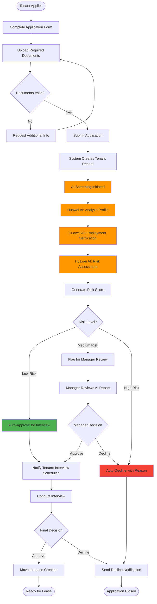
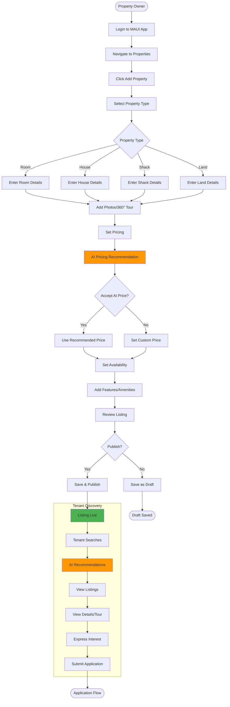
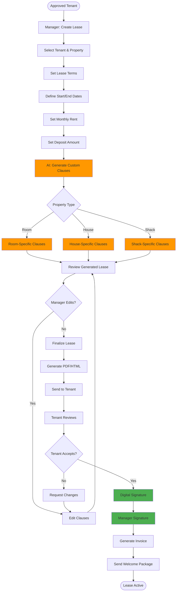
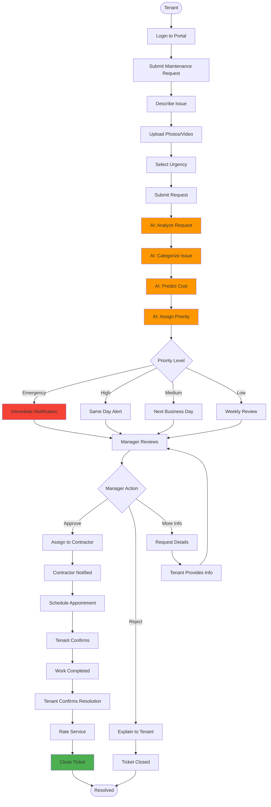
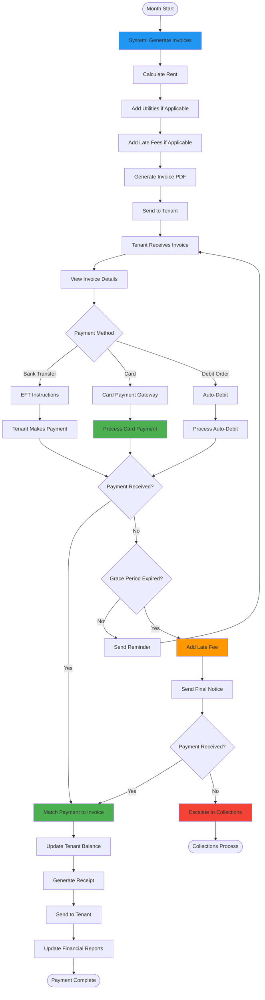
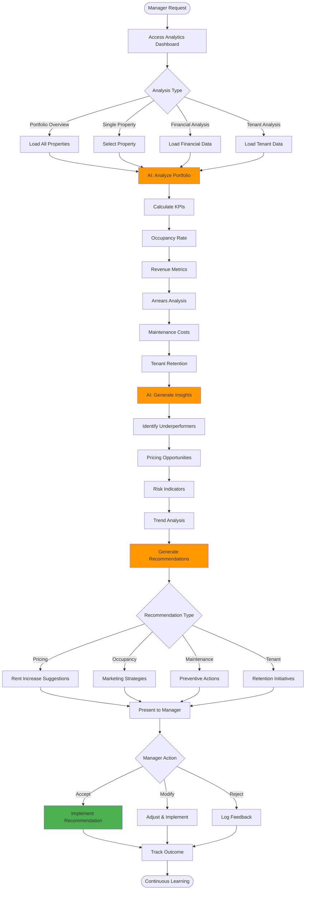
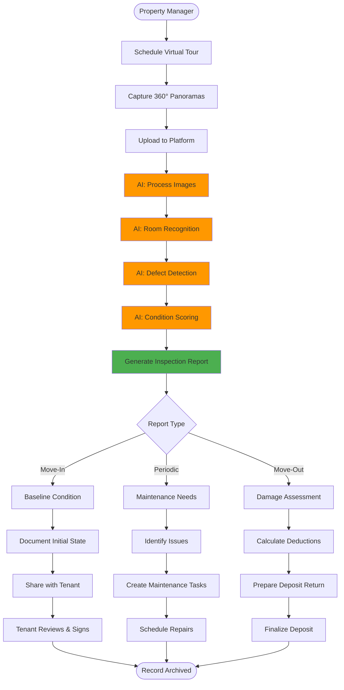
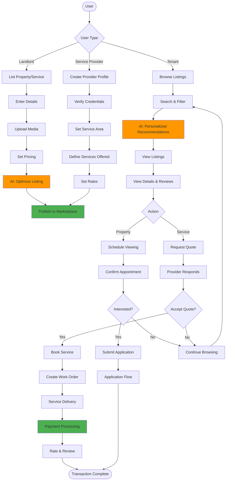

# PropTech Platform - Detailed User Flows

## Table of Contents
1. [Tenant Onboarding & Screening Flow](#1-tenant-onboarding--screening-flow)
2. [Property Listing & Discovery Flow](#2-property-listing--discovery-flow)
3. [Lease Creation & Signing Flow](#3-lease-creation--signing-flow)
4. [Maintenance Request & Resolution Flow](#4-maintenance-request--resolution-flow)
5. [Payment & Billing Flow](#5-payment--billing-flow)
6. [Portfolio Analytics Flow](#6-portfolio-analytics-flow)
7. [Virtual Tour & Inspection Flow](#7-virtual-tour--inspection-flow)
8. [Marketplace Flow](#8-marketplace-flow)

---

## 1. Tenant Onboarding & Screening Flow

### Overview
End-to-end flow from tenant application to approval decision with AI-powered risk assessment.

### User Story
*"As a property manager, I want to quickly screen tenant applications so I can make informed leasing decisions."*

### Flow Diagram

### Detailed Steps

#### Phase 1: Application Submission (Tenant)
1. **Access Application Portal**
   - Navigate to PropMate web portal
   - Select "Apply for Property"
   - Choose specific property or general application

2. **Personal Information**
   - Full name, ID number, contact details
   - Current address and living situation
   - Number of occupants

3. **Employment Information**
   - Employer name and contact
   - Position and tenure
   - Monthly income
   - Upload recent payslips (3 months)

4. **References**
   - Previous landlord contact details
   - Personal references (2 required)
   - Emergency contact

5. **Financial Information**
   - Banking details
   - Credit check authorization
   - Existing debt commitments

6. **Document Upload**
   - ID document/passport
   - Proof of income (payslips/bank statements)
   - Proof of address
   - Reference letters

#### Phase 2: AI Screening (Automated)
1. **Document Validation**
   - OCR text extraction from documents
   - Verify ID number format
   - Check document expiry dates

2. **NLP Analysis** (Huawei Pangu LLM)
   - Analyze employment stability
   - Extract income patterns
   - Identify red flags in history
   - Sentiment analysis on references

3. **Risk Prediction** (Huawei ModelArts)
   - Input features: income, employment, history
   - Run predictive model
   - Generate risk score (0-100)
   - Categorize: Low (0-30), Medium (31-60), High (61-100)

4. **Report Generation**
   - Compile screening results
   - List risk factors
   - Provide recommendation
   - Generate confidence score

#### Phase 3: Manager Review (Property Manager)
1. **Review Dashboard**
   - View pending applications
   - See AI risk scores prominently
   - Access full application details

2. **Deep Dive Analysis**
   - Review AI-generated report
   - Examine flagged items
   - View documents
   - Check references

3. **Decision Making**
   - Accept AI recommendation
   - Override with justification
   - Request additional information
   - Schedule interview

4. **Action Execution**
   - Send decision notification
   - Update tenant status
   - Log decision rationale
   - Move to next stage

### Success Criteria
- ✅ Application completion rate > 80%
- ✅ AI screening completion < 10 seconds
- ✅ Manager review time < 5 minutes
- ✅ Time-to-decision < 24 hours

### Error Scenarios
1. **Incomplete Documents**: System prompts for missing items
2. **AI Service Unavailable**: Queue for processing, manual fallback
3. **Invalid Information**: Validation errors with clear messages
4. **System Timeout**: Auto-save progress, resume later

---

## 2. Property Listing & Discovery Flow

### Overview
Property owners/managers list properties; prospective tenants discover and express interest.

### Flow Diagram

### Detailed Steps

#### Phase 1: Property Creation (Manager)
1. **Property Type Selection**
   - Room: Individual room in shared property
   - House: Standalone house
   - Shack: Informal housing unit
   - Land: Vacant land for development

2. **Basic Information**
   - Address (autocomplete with Google Maps)
   - Property size (sqm)
   - Number of bedrooms/bathrooms
   - Parking availability

3. **Media Upload**
   - Photos (minimum 5, recommended 10+)
   - 360° panorama (optional but recommended)
   - Floor plans (optional)
   - Videos (optional)

4. **Pricing Configuration**
   - Request AI pricing analysis
   - Review market comparables
   - Set monthly rent
   - Set deposit amount
   - Define lease terms

5. **Features & Amenities**
   - WiFi, electricity type, water supply
   - Security features
   - Appliances included
   - Pet policy
   - Accessibility features

6. **Compliance & Documentation**
   - Electrical certificate
   - Plumbing certificate
   - Insurance details
   - Rates clearance

#### Phase 2: AI Optimization (Automated)
1. **Pricing Analysis**
   - Scan market data for similar properties
   - Factor in location, amenities, condition
   - Recommend optimal price range
   - Predict time-to-lease

2. **SEO Optimization**
   - Generate compelling description
   - Suggest keywords
   - Optimize for search ranking

3. **Quality Scoring**
   - Assess listing completeness
   - Rate photo quality
   - Suggest improvements

#### Phase 3: Tenant Discovery
1. **Search & Filter**
   - Location-based search
   - Price range filter
   - Property type filter
   - Amenity filters
   - Availability date

2. **AI Recommendations**
   - Personalized suggestions based on:
     - Search history
     - Budget
     - Preferences
     - Life stage indicators

3. **Listing Interaction**
   - View photos and tours
   - Read description and reviews
   - Check location on map
   - Compare with favorites
   - Share listing

4. **Expression of Interest**
   - Save to favorites
   - Schedule viewing
   - Ask questions (chat)
   - Submit application

### Success Criteria
- ✅ Listing creation time < 10 minutes
- ✅ AI pricing accuracy within 10% of market
- ✅ Average time-to-lease < 14 days
- ✅ Tenant engagement rate > 30%

---

## 3. Lease Creation & Signing Flow

### Overview
Generate compliant lease agreement with AI-assisted clauses and digital workflow.

### Flow Diagram

### Detailed Steps

#### Phase 1: Lease Configuration
1. **Tenant & Property Selection**
   - Choose approved tenant from list
   - Select available property
   - System validates compatibility

2. **Term Configuration**
   - Lease start date (default: 1st of next month)
   - Lease duration (6/12/24 months)
   - Auto-renewal settings
   - Notice period (default: 30 days)

3. **Financial Terms**
   - Monthly rent amount (pre-filled from property)
   - Deposit (typically 1-2 months rent)
   - First month's rent payment
   - Prorated rent if mid-month start

4. **Additional Terms**
   - Utility responsibilities
   - Maintenance responsibilities
   - Pet policy
   - Subletting rules
   - House rules

#### Phase 2: AI Clause Generation
1. **Context Analysis**
   - Property type and features
   - Tenant profile and history
   - Legal requirements
   - Landlord preferences

2. **Clause Generation** (Huawei Pangu)
   - Generate property-specific clauses
   - Ensure SA Rental Housing Act compliance
   - Include risk mitigation based on screening
   - Add recommended insurance clauses

3. **Legal Validation**
   - Check against legal templates
   - Ensure all mandatory clauses present
   - Flag potential issues
   - Suggest improvements

#### Phase 3: Review & Signing
1. **Manager Review**
   - Review complete lease document
   - Check all clauses
   - Make manual edits if needed
   - Approve for sending

2. **Tenant Review**
   - Receive lease via email/portal
   - Read through all sections
   - Ask questions via chat
   - Request changes if needed

3. **Digital Signatures**
   - Tenant signs first
   - Manager signs second
   - System timestamps all signatures
   - Generate signed PDF

4. **Post-Signing Actions**
   - Generate initial invoice (deposit + 1st month)
   - Create tenant portal access
   - Send welcome email with:
     - Move-in checklist
     - Contact information
     - Portal login details
     - Payment instructions

### Success Criteria
- ✅ Lease generation time < 5 minutes
- ✅ AI clause accuracy > 95%
- ✅ Digital signing completion rate > 90%
- ✅ Time from approval to signed lease < 48 hours

---

## 4. Maintenance Request & Resolution Flow

### Overview
Tenants report issues, AI prioritizes, manager assigns, and tracks to resolution.

### Flow Diagram

### Detailed Steps

#### Phase 1: Issue Reporting (Tenant)
1. **Access Maintenance Portal**
   - Login to web/mobile app
   - Navigate to "Maintenance"
   - Click "Report Issue"

2. **Issue Description**
   - Category selection (Plumbing, Electrical, Structural, etc.)
   - Detailed description (guided prompts)
   - Location in property
   - When first noticed

3. **Evidence Upload**
   - Photos of issue (multiple angles)
   - Video if helpful
   - Audio recordings (for noise issues)

4. **Urgency Indication**
   - Emergency (safety/security risk)
   - High (major inconvenience)
   - Medium (moderate inconvenience)
   - Low (cosmetic/minor)

#### Phase 2: AI Triage (Automated)
1. **Image Analysis** (Huawei Cloud Vision)
   - Detect issue type from photos
   - Assess severity from visual cues
   - Identify safety hazards

2. **Text Analysis** (Huawei Pangu)
   - Parse description for keywords
   - Classify issue category
   - Extract urgency indicators

3. **Cost Prediction**
   - Compare with historical repairs
   - Factor in property type
   - Estimate material and labor costs
   - Provide cost range

4. **Priority Assignment**
   - Emergency: Immediate (< 2 hours)
   - High: Same day (< 8 hours)
   - Medium: Within 3 days
   - Low: Within 14 days

#### Phase 3: Manager Action
1. **Review Dashboard**
   - See all open tickets
   - Sorted by AI priority
   - Visual indicators for urgency
   - Estimated costs visible

2. **Ticket Analysis**
   - View all tenant-provided information
   - Review AI assessment
   - Check property maintenance history
   - Consider budget impact

3. **Decision Making**
   - Approve and assign
   - Request more information
   - Reject with explanation (tenant responsibility)
   - Escalate to landlord (major repair)

4. **Contractor Assignment**
   - Select from preferred contractors
   - Send work order with details
   - Set expected completion date
   - Define budget limit

#### Phase 4: Resolution & Feedback
1. **Work Scheduling**
   - Contractor proposes times
   - Tenant selects preferred slot
   - Automated reminders sent
   - Access instructions provided

2. **Work Completion**
   - Contractor updates status
   - Uploads completion photos
   - Submits invoice
   - Marks as complete

3. **Tenant Verification**
   - Tenant confirms satisfaction
   - Reports if issue persists
   - Rates contractor performance
   - Provides feedback

4. **Closure**
   - System closes ticket
   - Invoice processed for payment
   - Maintenance history updated
   - Insights logged for AI learning

### Success Criteria
- ✅ Average response time < 4 hours
- ✅ Emergency response < 2 hours
- ✅ AI triage accuracy > 85%
- ✅ Resolution rate > 95%
- ✅ Tenant satisfaction > 4.0/5

---

## 5. Payment & Billing Flow

### Overview
Automated invoice generation, multiple payment methods, and transparent financial tracking.

### Flow Diagram

### Detailed Steps

#### Phase 1: Invoice Generation (Automated)
1. **Monthly Trigger**
   - Cron job runs on 25th of month
   - Generate invoices for next month
   - Consider lease start dates
   - Handle prorated amounts

2. **Line Item Calculation**
   - Base rent from lease agreement
   - Utilities (if tenant-responsible)
   - Previous balance/arrears
   - Late fees from previous month
   - Any adjustments or credits

3. **Invoice Creation**
   - Generate unique invoice number
   - Set due date (typically 1st of month)
   - Apply tax if applicable
   - Calculate total amount
   - Create PDF document

4. **Distribution**
   - Email to tenant's registered address
   - Available in tenant portal
   - SMS notification with amount
   - WhatsApp message (if opted-in)

#### Phase 2: Tenant Payment
1. **Invoice Access**
   - Login to portal
   - View current and past invoices
   - See payment history
   - Check account balance

2. **Payment Method Selection**
   - **EFT/Bank Transfer**: Bank details displayed
   - **Card Payment**: Integrated payment gateway
   - **Debit Order**: Pre-authorized monthly debit
   - **Cash**: Payment at office (receipted)

3. **Payment Execution**
   - Enter payment reference
   - Confirm amount
   - Complete transaction
   - Receive confirmation

#### Phase 3: Payment Processing
1. **Automated Reconciliation**
   - Bank feed integration
   - Match payment reference to invoice
   - Update invoice status to "Paid"
   - Update tenant account balance

2. **Manual Reconciliation** (if needed)
   - Manager reviews unmatched payments
   - Manually allocates to correct invoice
   - Contacts tenant if unclear
   - Records any discrepancies

3. **Receipt Generation**
   - Auto-generate receipt on payment
   - Include all payment details
   - Email and portal availability
   - Compliant with tax requirements

#### Phase 4: Arrears Management
1. **Grace Period** (Days 1-7)
   - Friendly reminder on day 3
   - Second reminder on day 7
   - No penalties yet

2. **Late Fee Application** (Day 8+)
   - Apply late fee as per lease
   - Send formal notice
   - Update invoice with fee
   - Log as late payment

3. **Escalation** (Day 15+)
   - Final notice sent
   - Manager reviews account
   - Consider payment plan
   - Prepare for eviction if necessary

4. **Collections** (Day 30+)
   - Hand over to collections
   - Legal process initiated
   - Credit bureau reporting
   - Tenant status: In Arrears

### Success Criteria
- ✅ On-time payment rate > 85%
- ✅ Automated reconciliation > 95%
- ✅ Payment processing < 2 minutes
- ✅ Arrears < 10% of total rent roll

---

## 6. Portfolio Analytics Flow

### Overview
AI-powered insights and recommendations across entire property portfolio.

### Flow Diagram

### Detailed Steps

#### Phase 1: Data Collection
1. **Property Data**
   - Location, type, size, features
   - Current rent vs. market rate
   - Occupancy status and history
   - Maintenance history and costs
   - Virtual tour condition scores

2. **Tenant Data**
   - Current tenants and their profiles
   - Lease terms and expiration dates
   - Payment history and arrears
   - Maintenance request patterns
   - Satisfaction scores

3. **Financial Data**
   - Revenue per property
   - Operating expenses
   - Net operating income (NOI)
   - ROI calculations
   - Cash flow analysis

4. **Market Data**
   - Comparable property rents
   - Vacancy rates in area
   - Market trends
   - Economic indicators

#### Phase 2: AI Analysis
1. **Pattern Recognition**
   - Identify seasonal trends
   - Detect anomalies
   - Find correlations
   - Predict future patterns

2. **Performance Benchmarking**
   - Compare against market average
   - Rank properties by performance
   - Identify outliers
   - Calculate potential upside

3. **Risk Assessment**
   - Payment risk by tenant
   - Property maintenance risk
   - Market risk factors
   - Regulatory compliance risk

4. **Opportunity Identification**
   - Underpriced properties
   - High-performing properties for replication
   - Expansion opportunities
   - Optimization potential

#### Phase 3: Insight Generation
1. **Executive Summary**
   - Key metrics dashboard
   - Trend highlights
   - Top 3 actions needed
   - ROI impact estimates

2. **Deep Dive Reports**
   - Property-by-property analysis
   - Tenant segmentation
   - Financial projections
   - Scenario modeling

3. **Actionable Recommendations**
   - Prioritized by impact
   - Implementation difficulty
   - Resource requirements
   - Expected outcomes

#### Phase 4: Action & Tracking
1. **Implementation**
   - Manager reviews recommendations
   - Selects actions to pursue
   - Assigns tasks
   - Sets timelines

2. **Monitoring**
   - Track implementation progress
   - Measure actual vs. predicted impact
   - Adjust as needed
   - Report back to AI for learning

3. **Continuous Improvement**
   - AI learns from outcomes
   - Refines future recommendations
   - Improves prediction accuracy
   - Adapts to changing conditions

### Key Metrics Tracked

#### Financial Metrics
- **Gross Rental Income**: Total rent collected
- **Net Operating Income (NOI)**: Income minus expenses
- **ROI**: Return on investment percentage
- **Occupancy Rate**: % of units occupied
- **Arrears Rate**: % of rent in arrears

#### Operational Metrics
- **Vacancy Duration**: Days from empty to occupied
- **Tenant Retention**: % of tenants renewing
- **Maintenance Cost Ratio**: Maintenance costs / Rent
- **Response Time**: Average time to resolve issues

#### Quality Metrics
- **Tenant Satisfaction**: Average rating
- **Property Condition Score**: From virtual tours
- **Complaint Rate**: Issues per 100 units/month
- **Renewal Rate**: % of leases renewed

### Success Criteria
- ✅ Dashboard load time < 3 seconds
- ✅ AI insight generation < 30 seconds
- ✅ Recommendation accuracy > 80%
- ✅ Manager action rate > 60%

---

## 7. Virtual Tour & Inspection Flow

### Overview
360° property tours with AI-powered visual inspection and condition reporting.

### Flow Diagram

### Detailed Steps

#### Phase 1: Tour Capture
1. **Planning**
   - Schedule appropriate time
   - Ensure good lighting
   - Clean and prepare space
   - Brief photographer/staff

2. **Equipment Setup**
   - 360° camera (e.g., Ricoh Theta, Insta360)
   - Tripod for stability
   - Lighting equipment if needed
   - Backup battery and storage

3. **Capture Process**
   - Photograph each room
   - Multiple angles per large room
   - Include all areas (closets, bathrooms)
   - Capture exterior views
   - Take detail shots of fixtures

4. **Upload & Organization**
   - Transfer files to platform
   - Label each room/area
   - Add descriptive notes
   - Link to property record

#### Phase 2: AI Analysis
1. **Image Processing** (Huawei Cloud Vision)
   - Stitch panoramas if needed
   - Enhance image quality
   - Correct exposure/color
   - Remove distortion

2. **Room Recognition**
   - Identify room type (bedroom, kitchen, bathroom)
   - Detect fixtures and features
   - Measure dimensions (if metadata available)
   - Map layout

3. **Defect Detection**
   - **Walls**: Cracks, holes, stains, peeling paint
   - **Ceilings**: Water damage, cracks, sagging
   - **Floors**: Scratches, stains, broken tiles
   - **Fixtures**: Broken, damaged, missing items
   - **Windows/Doors**: Cracks, broken seals, alignment

4. **Condition Scoring**
   - Overall property score (0-100)
   - Room-by-room scores
   - Severity classification:
     - Critical: Safety/security issue
     - Major: Significant damage
     - Minor: Cosmetic issues
     - Good: No issues detected

5. **Cost Estimation**
   - Match defects to repair database
   - Estimate material costs
   - Estimate labor hours
   - Provide cost range

#### Phase 3: Report Generation
1. **Move-In Inspection Report**
   - Complete room inventory
   - Condition notes per area
   - Photos with annotations
   - Tenant acknowledgment section
   - Landlord signature section

2. **Periodic Inspection Report**
   - Changes since last inspection
   - New defects identified
   - Maintenance priorities
   - Cost estimates
   - Recommended actions

3. **Move-Out Inspection Report**
   - Compare to move-in condition
   - Identify tenant-caused damage
   - Normal wear vs. damage
   - Deposit deduction calculations
   - Repair requirements

#### Phase 4: Action & Documentation
1. **Tenant Review** (Move-In/Out)
   - Access report via portal
   - Review findings
   - Dispute if disagreed
   - Digitally sign acknowledgment

2. **Maintenance Planning** (Periodic)
   - Manager reviews issues
   - Prioritizes repairs
   - Creates work orders
   - Schedules contractors

3. **Deposit Settlement** (Move-Out)
   - Calculate deductions
   - Send itemized statement
   - Process refund
   - Handle disputes

4. **Record Keeping**
   - Archive all reports
   - Link to tenant/property records
   - Store photos securely
   - Maintain audit trail

### Use Cases

#### 1. Move-In Protection
- Document property condition before tenant moves in
- Protect landlord and tenant from disputes
- Establish baseline for move-out comparison

#### 2. Remote Inspections
- Conduct inspections without physical visits
- Useful for distant properties
- Save time and travel costs

#### 3. Maintenance Planning
- Regular condition monitoring
- Proactive issue identification
- Budget forecasting

#### 4. Marketing
- Virtual tours for prospective tenants
- Show property remotely
- Reduce unnecessary viewings

#### 5. Insurance Claims
- Document damage for claims
- Provide visual evidence
- Speed up claim processing

### Success Criteria
- ✅ AI defect detection accuracy > 85%
- ✅ Cost estimation accuracy within 20%
- ✅ Report generation < 60 seconds
- ✅ Tenant dispute rate < 5%

---

## 8. Marketplace Flow

### Overview
Connect property owners, tenants, and service providers in a trusted marketplace.

### Flow Diagram

### Detailed Steps

#### Phase 1: Listing Creation

##### Property Listing
1. **Basic Information**
   - Property type and details
   - Location and address
   - Rent and deposit
   - Available from date

2. **Media & Description**
   - Photos and virtual tours
   - Detailed description
   - Amenities and features
   - House rules

3. **AI Enhancement**
   - Suggest description improvements
   - Optimize for searchability
   - Recommend competitive pricing
   - Predict time-to-lease

##### Service Provider Listing
1. **Business Profile**
   - Company name and registration
   - Contact information
   - Service area (radius/suburbs)
   - Years in business

2. **Credentials**
   - Upload certifications
   - Insurance documentation
   - Reference letters
   - Portfolio/past work

3. **Services & Pricing**
   - Service categories offered
   - Rate structure (hourly/fixed)
   - Availability calendar
   - Response time commitment

#### Phase 2: Discovery & Matching

##### Tenant Search
1. **Browse Interface**
   - Map view with pins
   - List view with filters
   - Grid view with photos
   - Comparison view (side-by-side)

2. **Filters**
   - Price range
   - Location (distance from point)
   - Property type
   - Bedrooms/bathrooms
   - Amenities required
   - Pet-friendly
   - Available date

3. **AI Recommendations**
   - Based on search history
   - Similar to viewed properties
   - Matching budget and preferences
   - Popular in desired area

##### Service Provider Search
1. **Need Identification**
   - Category selection (plumbing, electrical, etc.)
   - Urgency level
   - Budget range
   - Preferred dates

2. **Provider Matching**
   - Available providers in area
   - Sorted by rating and proximity
   - Verified badge for certified providers
   - Response time indicators

3. **Quote Requests**
   - Describe job requirements
   - Upload photos if relevant
   - Set budget expectations
   - Request timeline

#### Phase 3: Engagement

##### Property Viewing
1. **Schedule Request**
   - Select preferred date/time
   - Virtual or in-person
   - Bring guests? (Yes/No)
   - Special requirements

2. **Confirmation**
   - Landlord approves time
   - Add to calendar
   - Directions provided
   - Viewing checklist sent

3. **Follow-Up**
   - Post-viewing feedback request
   - Express interest option
   - Apply for lease
   - Ask questions

##### Service Booking
1. **Quote Review**
   - Compare multiple quotes
   - Review provider profiles
   - Check ratings and reviews
   - Verify insurance and credentials

2. **Booking Confirmation**
   - Accept quote
   - Confirm date/time
   - Review scope of work
   - Agree on payment terms

3. **Pre-Service**
   - Automated reminders
   - Access instructions
   - Emergency contact exchange
   - Confirm special requirements

#### Phase 4: Transaction & Review

##### Property Application
- Flows into standard tenant onboarding (see Flow #1)

##### Service Delivery
1. **Job Initiation**
   - Provider checks in
   - Reviews scope with customer
   - Begins work
   - Updates status in real-time

2. **Completion**
   - Provider marks complete
   - Uploads photos of completed work
   - Requests customer sign-off
   - Submits invoice

3. **Payment**
   - Customer reviews work
   - Approves payment
   - Processes via platform
   - Provider receives payment (minus fee)

4. **Review & Rating**
   - Customer rates provider (1-5 stars)
   - Writes review (optional)
   - Provider rates customer
   - Reviews published on profiles

### Marketplace Features

#### Trust & Safety
- **Verification**: ID and business verification required
- **Reviews**: Transparent rating system
- **Escrow**: Payment held until job completion
- **Insurance**: Verified insurance coverage
- **Dispute Resolution**: Mediation service available

#### Quality Control
- **Performance Monitoring**: Track provider metrics
- **Quality Audits**: Random inspections
- **Customer Support**: Dedicated support team
- **Sanctions**: Remove poor performers

#### Pricing & Revenue
- **Landlord Listings**: Free for basic, premium for featured
- **Tenant Access**: Free to browse and apply
- **Service Providers**: Commission on completed jobs (10-15%)
- **Premium Features**: Priority listing, analytics, verified badge

### Success Criteria
- ✅ Listing-to-viewing conversion > 20%
- ✅ Viewing-to-application conversion > 40%
- ✅ Service provider response time < 4 hours
- ✅ Overall marketplace rating > 4.2/5
- ✅ Repeat transaction rate > 30%

---

## Cross-Flow Integrations

### 1. Onboarding → Lease Creation → Billing
Seamless flow from approved applicant to active paying tenant.

### 2. Maintenance → Marketplace → Payment
Tenant reports issue → Manager assigns service provider → Work completed → Payment processed.

### 3. Virtual Tour → Listing → Discovery
New property tour captured → Enhanced with AI → Published → Tenants discover.

### 4. Portfolio Analytics → Pricing → Listing
AI identifies underpriced property → Manager adjusts rent → Existing tenant notified or new listing updated.

### 5. Lease End → Virtual Tour → Deposit Return
Lease expiring → Schedule move-out inspection → Compare with move-in → Process deposit.

---

## User Flow Testing Checklist

### For Each Flow
- [ ] Happy path works end-to-end
- [ ] Error scenarios handled gracefully
- [ ] Notifications sent at key points
- [ ] Data persisted correctly
- [ ] Audit trail maintained
- [ ] Permissions enforced
- [ ] Performance acceptable
- [ ] Mobile-responsive (for web flows)

### Cross-Flow Testing
- [ ] Data flows between modules
- [ ] No duplicate data entry
- [ ] Consistent user experience
- [ ] Context maintained across flows
- [ ] Navigation intuitive

---

## Continuous Improvement

All flows are monitored for:
- **Completion rates**: % who finish the flow
- **Drop-off points**: Where users abandon
- **Time to complete**: Average duration
- **Error rates**: Technical and user errors
- **User satisfaction**: Post-flow surveys

AI learns from all interactions to improve recommendations, reduce friction, and enhance outcomes.
