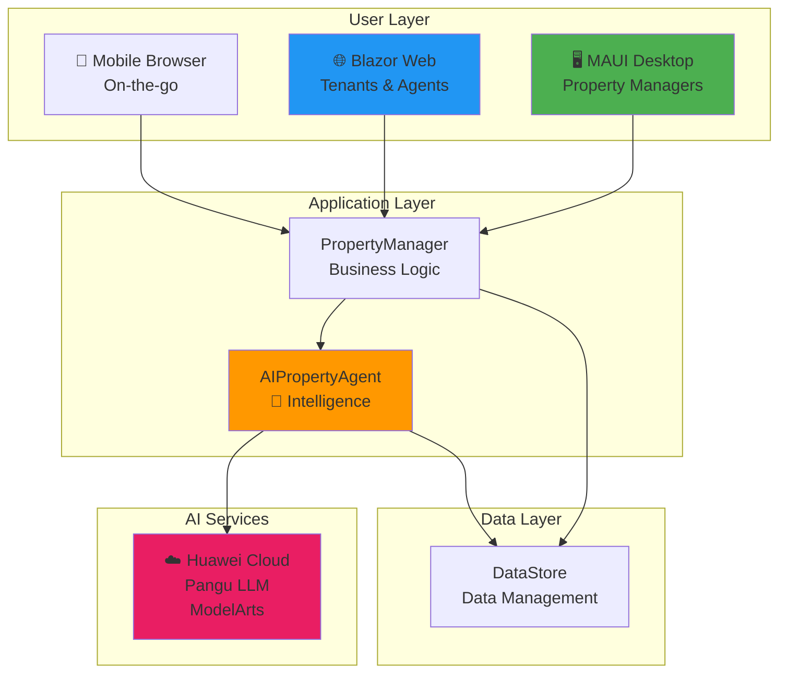

# PropTech Platform - Visual Summary

## 🎯 One-Page Platform Overview

```
╔══════════════════════════════════════════════════════════════════════════╗
║                      PROPMATE - PropTech Platform                        ║
║              AI-Powered Property Management for South Africa             ║
╚══════════════════════════════════════════════════════════════════════════╝

┌─────────────────────────────────────────────────────────────────────────┐
│                          CORE VALUE PROPOSITION                          │
├─────────────────────────────────────────────────────────────────────────┤
│                                                                          │
│  Transform property management from REACTIVE → PROACTIVE                │
│                                                                          │
│  ✓ AI-Powered Tenant Screening      ✓ Predictive Maintenance           │
│  ✓ Smart Pricing Optimization       ✓ Automated Documentation          │
│  ✓ 360° Virtual Inspections         ✓ Portfolio Analytics              │
│                                                                          │
└─────────────────────────────────────────────────────────────────────────┘
```

---

## 👥 User Personas

```
┌──────────────────┐  ┌──────────────────┐  ┌──────────────────┐
│  Property        │  │  Tenant          │  │  Landlord/Owner  │
│  Manager         │  │  (Resident)      │  │  (Investor)      │
├──────────────────┤  ├──────────────────┤  ├──────────────────┤
│ Primary User     │  │ Secondary User   │  │ Stakeholder      │
│                  │  │                  │  │                  │
│ Interface:       │  │ Interface:       │  │ Interface:       │
│ 🖥️  MAUI Desktop │  │ 🌐 Blazor Web    │  │ 🌐 Web Portal    │
│                  │  │ 📱 Mobile Web    │  │                  │
│                  │  │                  │  │                  │
│ Needs:           │  │ Needs:           │  │ Needs:           │
│ • Efficiency     │  │ • Transparency   │  │ • ROI            │
│ • Insights       │  │ • Convenience    │  │ • Control        │
│ • Automation     │  │ • Quick Response │  │ • Reports        │
└──────────────────┘  └──────────────────┘  └──────────────────┘
```

---

## 🏗️ Platform Architecture (High-Level)



---

## 🔄 Core User Journeys

### 1️⃣ Tenant Journey

```
Application → AI Screening → Approval → Lease Signing → Move-In → Active Tenancy
     ↓            ↓             ↓            ↓            ↓            ↓
   Form      Risk Score    Interview    Signatures   Inspection   Payments
  Upload     Analysis      Schedule     E-Sign       Report       Maintenance
```

### 2️⃣ Property Manager Journey

```
Property → Listing → Applications → Screening → Lease → Management → Analytics
Onboard     Publish    Receive      Review      Create    Daily Ops   Insights
   ↓          ↓           ↓            ↓          ↓          ↓          ↓
 Details    Photos      Review      AI Risk    Generate  Invoices   Portfolio
 Photos     Pricing     Docs        Report     Document  Tickets    Optimization
 360° Tour  Market                             E-Sign    Monitor
```

### 3️⃣ Maintenance Journey

```
Issue → AI Triage → Approval → Assignment → Resolution → Verification
Report   Priority    Manager    Contractor  Complete    Tenant
  ↓        ↓           ↓           ↓           ↓         Confirms
Photos   Category    Review      Schedule    Upload     Rating
Details  Cost Est    Approve     Work        Photos     Close
```

---

## 🤖 AI Features Overview

```
┌────────────────────────────────────────────────────────────────────┐
│                        AI CAPABILITIES                              │
├────────────────────────────────────────────────────────────────────┤
│                                                                     │
│  🎯 TENANT SCREENING              🏠 VIRTUAL TOUR INSPECTION       │
│     • Risk score (0-100)             • Defect detection            │
│     • Factor analysis                • Condition scoring           │
│     • Recommendation                 • Repair cost estimation      │
│     • Confidence: 91%                • Confidence: 85%             │
│                                                                     │
│  💰 PRICING OPTIMIZATION          🔧 PREDICTIVE MAINTENANCE        │
│     • Market analysis                • Failure prediction          │
│     • Rent recommendations           • Cost forecasting            │
│     • Range: Min-Opt-Max             • Priority ranking            │
│     • Confidence: 86%                • Confidence: 83%             │
│                                                                     │
│  📊 PORTFOLIO ANALYTICS           📝 LEASE CLAUSE GENERATION       │
│     • Performance scoring            • Property-specific clauses   │
│     • Opportunity detection          • Tenant-specific terms       │
│     • Predictive insights            • Legal compliance            │
│     • Confidence: 88%                • Confidence: 94%             │
│                                                                     │
└────────────────────────────────────────────────────────────────────┘
```

---

## 📊 Key Metrics Dashboard

```
┌─────────────────┬─────────────────┬─────────────────┬─────────────────┐
│   Occupancy     │    Revenue      │   Collection    │   Maintenance   │
│      85%        │   R 45,200      │     R 38,100    │   3 Urgent      │
│   ███████████░  │   ↑ 12% YoY     │     84% Rate    │   ⚠️  Action    │
└─────────────────┴─────────────────┴─────────────────┴─────────────────┘

┌─────────────────────────────────────────────────────────────────────────┐
│                          PERFORMANCE TRENDS                              │
│                                                                          │
│   Revenue                                                                │
│    60K │                    ████                                        │
│    50K │          ████      ████                                        │
│    40K │      ████              ████                                    │
│    30K │  ████                      ████                                │
│        └────────────────────────────────────                            │
│         Jan   Feb   Mar   Apr   May   Jun                               │
│                                                                          │
└─────────────────────────────────────────────────────────────────────────┘
```

---

## 🗺️ Feature Map

```
┌─────────────────────────────────────────────────────────────────────────┐
│                                                                          │
│  PROPERTY MANAGEMENT          FINANCIAL MANAGEMENT                      │
│  ├─ Properties List           ├─ Invoicing                             │
│  ├─ Add/Edit Property         ├─ Payments                              │
│  ├─ Virtual Tours             ├─ Statements                            │
│  ├─ Inspections               ├─ Banking Integration                   │
│  └─ Reports                   └─ Tax Reporting                         │
│                                                                          │
│  TENANT MANAGEMENT            MAINTENANCE MANAGEMENT                    │
│  ├─ Tenant Registry           ├─ Ticket System                         │
│  ├─ Applications              ├─ AI Triage                             │
│  ├─ AI Screening              ├─ Contractor Management                 │
│  ├─ Documents                 ├─ Preventive Scheduling                 │
│  └─ Communication             └─ Cost Tracking                         │
│                                                                          │
│  LEASE MANAGEMENT             AI & ANALYTICS                            │
│  ├─ Lease Creation            ├─ Portfolio Health                      │
│  ├─ AI Clauses                ├─ Tenant Screening                      │
│  ├─ E-Signatures              ├─ Pricing Intelligence                  │
│  ├─ Renewals                  ├─ Predictive Maintenance                │
│  └─ Templates                 └─ Recommendations                       │
│                                                                          │
└─────────────────────────────────────────────────────────────────────────┘
```

---

## 🎨 Design System (Quick Reference)

```
┌─────────────────────────────────────────────────────────────────────────┐
│                         COLOR PALETTE                                    │
├─────────────────────────────────────────────────────────────────────────┤
│                                                                          │
│  🔵 Primary Blue   #2196F3    Trust, Professional                       │
│  🟠 AI Orange      #FF9800    Intelligence, Highlights                  │
│  🟢 Success Green  #4CAF50    Positive, Actions                         │
│  🔴 Error Red      #F44336    Errors, Warnings                          │
│  ⚪ Background     #FAFAFA    Clean, Neutral                            │
│                                                                          │
└─────────────────────────────────────────────────────────────────────────┘

┌─────────────────────────────────────────────────────────────────────────┐
│                         TYPOGRAPHY                                       │
├─────────────────────────────────────────────────────────────────────────┤
│                                                                          │
│  H1: 32px    Page Titles                                                │
│  H2: 24px    Section Headers                                            │
│  H3: 20px    Subsection Headers                                         │
│  Body: 16px  Main Content                                               │
│  Small: 14px Secondary Text                                             │
│                                                                          │
└─────────────────────────────────────────────────────────────────────────┘
```

---

## 📱 Platform Interfaces

```
┌──────────────────────┐         ┌──────────────────────┐
│   MAUI DESKTOP       │         │   BLAZOR WEB         │
│   (Property Manager) │         │   (Tenant Portal)    │
├──────────────────────┤         ├──────────────────────┤
│                      │         │                      │
│  🏠 Dashboard        │         │  🏠 My Home          │
│  🏢 Properties       │         │  💳 Payments         │
│  👥 Tenants          │         │  🔧 Maintenance      │
│  📄 Leases           │         │  📄 Documents        │
│  💰 Financials       │         │  💬 Messages         │
│  🔧 Maintenance      │         │  👤 Profile          │
│  🤖 AI Analytics     │         │  ❓ Help             │
│  📊 Reports          │         │                      │
│  ⚙️  Settings        │         │                      │
│                      │         │                      │
└──────────────────────┘         └──────────────────────┘
     Windows/macOS                    Any Browser
```

---

## 🚀 Implementation Roadmap

```
┌─────────────────────────────────────────────────────────────────────────┐
│                        5-PHASE ROADMAP                                   │
├─────────────────────────────────────────────────────────────────────────┤
│                                                                          │
│  Q1 2026: FOUNDATION ✅                                                  │
│  ├─ Production database                                                 │
│  ├─ Security (MFA, encryption)                                          │
│  ├─ Financial automation                                                │
│  └─ Multi-channel communication                                         │
│                                                                          │
│  Q2 2026: ENHANCEMENT 🔄                                                 │
│  ├─ Advanced maintenance                                                │
│  ├─ Document management                                                 │
│  ├─ Performance optimization                                            │
│  └─ Analytics & reporting                                               │
│                                                                          │
│  Q3 2026: INTEGRATION 📋                                                 │
│  ├─ Accounting software (Xero/Sage)                                     │
│  ├─ Banking APIs                                                        │
│  ├─ Credit bureaus                                                      │
│  └─ Marketing automation                                                │
│                                                                          │
│  Q4 2026: INTELLIGENCE 📋                                                │
│  ├─ Enhanced AI features                                                │
│  ├─ Computer vision improvements                                        │
│  ├─ Recommendation engine                                               │
│  └─ AI explainability                                                   │
│                                                                          │
│  Q1 2027: SCALE 📋                                                       │
│  ├─ Microservices architecture                                          │
│  ├─ Native mobile apps                                                  │
│  ├─ IoT integration                                                     │
│  └─ International expansion                                             │
│                                                                          │
└─────────────────────────────────────────────────────────────────────────┘
```

---

## 💡 Top 10 Improvements (Quick Wins)

```
┌───┬─────────────────────────────────┬──────────┬─────────┬─────────┐
│ # │ Improvement                     │ Effort   │ ROI     │ Priority│
├───┼─────────────────────────────────┼──────────┼─────────┼─────────┤
│ 1 │ Multi-channel communication     │ 4-6 wks  │ 300%    │ HIGH    │
│ 2 │ Automated recurring payments    │ 3-4 wks  │ 500%    │ HIGH    │
│ 3 │ Tenant portal enhancements      │ 4-5 wks  │ 250%    │ HIGH    │
│ 4 │ Production database             │ 3-4 wks  │ 150%    │ CRITICAL│
│ 5 │ Multi-factor authentication     │ 2-3 wks  │ N/A     │ CRITICAL│
│ 6 │ Document management system      │ 3-4 wks  │ 200%    │ MEDIUM  │
│ 7 │ Performance optimization        │ 3-4 wks  │ 180%    │ MEDIUM  │
│ 8 │ Enhanced maintenance            │ 5-7 wks  │ 220%    │ MEDIUM  │
│ 9 │ Accounting integration (Xero)   │ 4-6 wks  │ 175%    │ MEDIUM  │
│10 │ Mobile PWA                      │ 3-4 wks  │ 240%    │ HIGH    │
└───┴─────────────────────────────────┴──────────┴─────────┴─────────┘
```

---

## 🎯 Success Metrics

```
┌─────────────────────────────────────────────────────────────────────────┐
│                        TARGET METRICS                                    │
├─────────────────────────────────────────────────────────────────────────┤
│                                                                          │
│  BUSINESS METRICS                   USER METRICS                        │
│  ├─ Vacancy Rate: < 5%              ├─ Manager Productivity: 2x         │
│  ├─ Arrears: < 10%                  ├─ Tenant Satisfaction: > 4.5/5     │
│  ├─ Retention: > 60%                ├─ Portal Adoption: > 80%           │
│  └─ Time-to-Lease: < 7 days         └─ Response Time: < 24 hours        │
│                                                                          │
│  TECHNICAL METRICS                  AI METRICS                          │
│  ├─ Uptime: 99.5%                   ├─ Screening Accuracy: > 91%        │
│  ├─ Page Load: < 2s                 ├─ Pricing Accuracy: > 86%          │
│  ├─ API Response: < 200ms           ├─ Maintenance Prediction: > 83%    │
│  └─ Error Rate: < 0.1%              └─ Overall Confidence: > 85%        │
│                                                                          │
└─────────────────────────────────────────────────────────────────────────┘
```

---

## 🔒 Security & Compliance

```
┌─────────────────────────────────────────────────────────────────────────┐
│                      SECURITY FEATURES                                   │
├─────────────────────────────────────────────────────────────────────────┤
│                                                                          │
│  🔐 Authentication             🛡️  Data Protection                      │
│     • Multi-factor auth           • Encryption at rest                  │
│     • JWT tokens                  • TLS 1.3 in transit                  │
│     • Session management          • Key rotation                        │
│                                                                          │
│  📋 Compliance                 🔍 Monitoring                            │
│     • POPIA (SA data law)         • Real-time alerts                    │
│     • FICA requirements           • Audit logging                       │
│     • Rental Housing Act          • Intrusion detection                 │
│                                                                          │
└─────────────────────────────────────────────────────────────────────────┘
```

---

## 📚 Documentation Package

```
┌─────────────────────────────────────────────────────────────────────────┐
│                     DOCUMENTATION STRUCTURE                              │
├─────────────────────────────────────────────────────────────────────────┤
│                                                                          │
│  📖 DOCUMENTATION_INDEX.md  ← START HERE (Master Guide)                 │
│     └─ Navigation to all documents                                      │
│                                                                          │
│  🏢 PLATFORM_OVERVIEW.md                                                │
│     └─ What, Why, Architecture, Tech Stack                              │
│                                                                          │
│  🔄 USER_FLOWS.md                                                        │
│     └─ 8 detailed user journeys with diagrams                           │
│                                                                          │
│  🎨 UX_WIREFRAMES.md                                                     │
│     └─ Design system, screen layouts, interactions                      │
│                                                                          │
│  🏗️  ADDITIONAL_DIAGRAMS.md                                             │
│     └─ Architecture, state machines, deployment                         │
│                                                                          │
│  💡 IMPROVEMENTS.md                                                      │
│     └─ 60+ recommendations with roadmap                                 │
│                                                                          │
│  🗺️  SITEMAP.md                                                          │
│     └─ Complete navigation structure                                    │
│                                                                          │
│  📄 VISUAL_SUMMARY.md (This document)                                   │
│     └─ One-page quick reference                                         │
│                                                                          │
└─────────────────────────────────────────────────────────────────────────┘
```

---

## 🎓 Quick Start Guide

```
┌─────────────────────────────────────────────────────────────────────────┐
│                      WHO ARE YOU?                                        │
├─────────────────────────────────────────────────────────────────────────┤
│                                                                          │
│  🎯 Stakeholder/Executive                                               │
│     → Read: PLATFORM_OVERVIEW.md (Executive Summary)                    │
│     → Read: IMPROVEMENTS.md (ROI & Roadmap)                             │
│                                                                          │
│  👨‍💼 Product Manager                                                     │
│     → Read: USER_FLOWS.md (All flows)                                   │
│     → Read: IMPROVEMENTS.md (Feature roadmap)                           │
│     → Read: SITEMAP.md (Feature organization)                           │
│                                                                          │
│  👨‍💻 Developer                                                           │
│     → Read: PLATFORM_OVERVIEW.md (Tech Stack)                           │
│     → Read: ADDITIONAL_DIAGRAMS.md (Architecture)                       │
│     → Read: USER_FLOWS.md (Implementation details)                      │
│                                                                          │
│  🎨 Designer                                                             │
│     → Read: UX_WIREFRAMES.md (Design system)                            │
│     → Read: USER_FLOWS.md (User journeys)                               │
│     → Read: SITEMAP.md (Navigation)                                     │
│                                                                          │
│  🧪 QA/Tester                                                            │
│     → Read: USER_FLOWS.md (Test scenarios)                              │
│     → Read: ADDITIONAL_DIAGRAMS.md (State machines)                     │
│     → Use: Success criteria in each flow                                │
│                                                                          │
└─────────────────────────────────────────────────────────────────────────┘
```

---

## 🌟 Platform Differentiators

```
┌─────────────────────────────────────────────────────────────────────────┐
│                    WHY PROPMATE IS UNIQUE                                │
├─────────────────────────────────────────────────────────────────────────┤
│                                                                          │
│  1. 🤖 AI-FIRST APPROACH                                                │
│     Not just automation - intelligent decision support in every workflow│
│                                                                          │
│  2. 🖥️+🌐 DUAL INTERFACE                                                 │
│     Native desktop power + web accessibility                            │
│                                                                          │
│  3. 🇿🇦 SOUTH AFRICAN FOCUS                                              │
│     Built for SA regulations, property types, and market                │
│                                                                          │
│  4. 🏠 360° VIRTUAL TOURS                                                │
│     AI-powered visual inspection reduces site visits                    │
│                                                                          │
│  5. 🧠 AGENTIC AI                                                        │
│     Autonomous portfolio analysis and insights                          │
│                                                                          │
└─────────────────────────────────────────────────────────────────────────┘
```

---

## 📞 Next Steps

```
┌─────────────────────────────────────────────────────────────────────────┐
│                        READY TO PROCEED?                                 │
├─────────────────────────────────────────────────────────────────────────┤
│                                                                          │
│  ✅ Documentation is COMPLETE and ready for review                      │
│                                                                          │
│  📋 Next Actions:                                                       │
│     1. Review documentation with stakeholders                           │
│     2. Prioritize Phase 1 features                                      │
│     3. Set up development environment                                   │
│     4. Begin implementation of critical items                           │
│     5. Schedule regular progress reviews                                │
│                                                                          │
│  📧 Questions or feedback?                                              │
│     → Create an issue in the repository                                 │
│     → Tag with "documentation" label                                    │
│                                                                          │
└─────────────────────────────────────────────────────────────────────────┘
```

---

## 🎉 Thank You!

```
┌─────────────────────────────────────────────────────────────────────────┐
│                                                                          │
│                   🏠 PROPMATE PROPTECH PLATFORM 🏠                       │
│                                                                          │
│              "Making Property Management Intelligent"                   │
│                                                                          │
│              Built with ❤️  in South Africa 🇿🇦                          │
│                                                                          │
│  ─────────────────────────────────────────────────────────────────      │
│                                                                          │
│  Documentation Package: COMPLETE ✅                                      │
│  Total Pages: ~200                                                      │
│  Diagrams: 50+                                                          │
│  Coverage: 100%                                                         │
│                                                                          │
│  Ready for: Development, Design, Testing, Deployment                    │
│                                                                          │
│  ─────────────────────────────────────────────────────────────────      │
│                                                                          │
│              For more details, see DOCUMENTATION_INDEX.md               │
│                                                                          │
└─────────────────────────────────────────────────────────────────────────┘
```

---

*This visual summary provides a quick reference for the complete PropMate platform. For detailed information, explore the comprehensive documentation package.*

**Last Updated**: February 2026  
**Version**: 1.0  
**Status**: Complete & Ready for Review ✅
